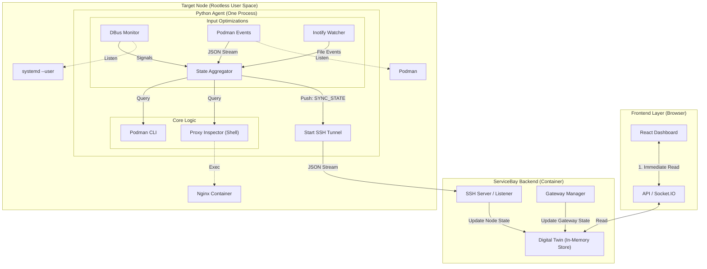
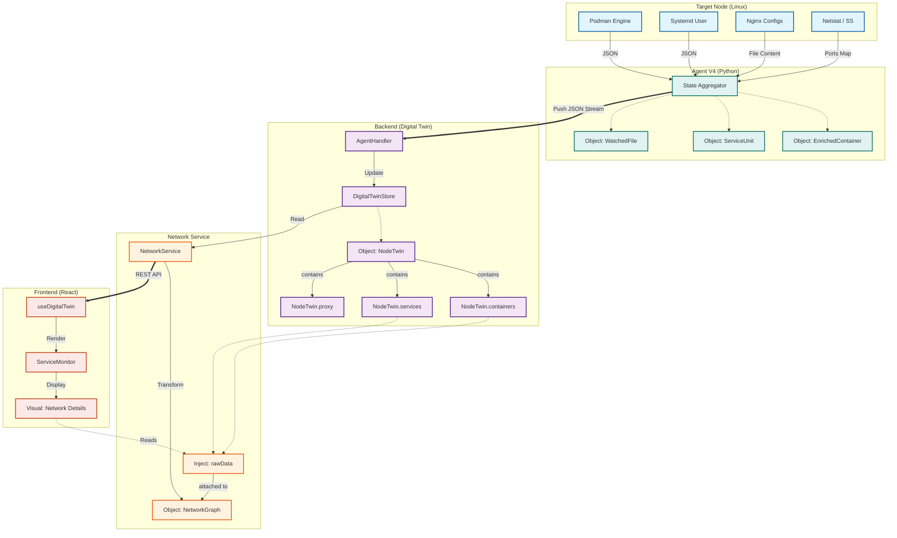
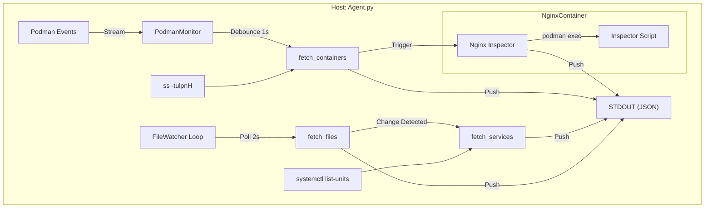
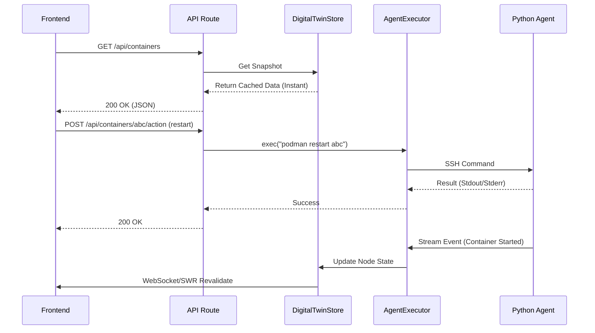
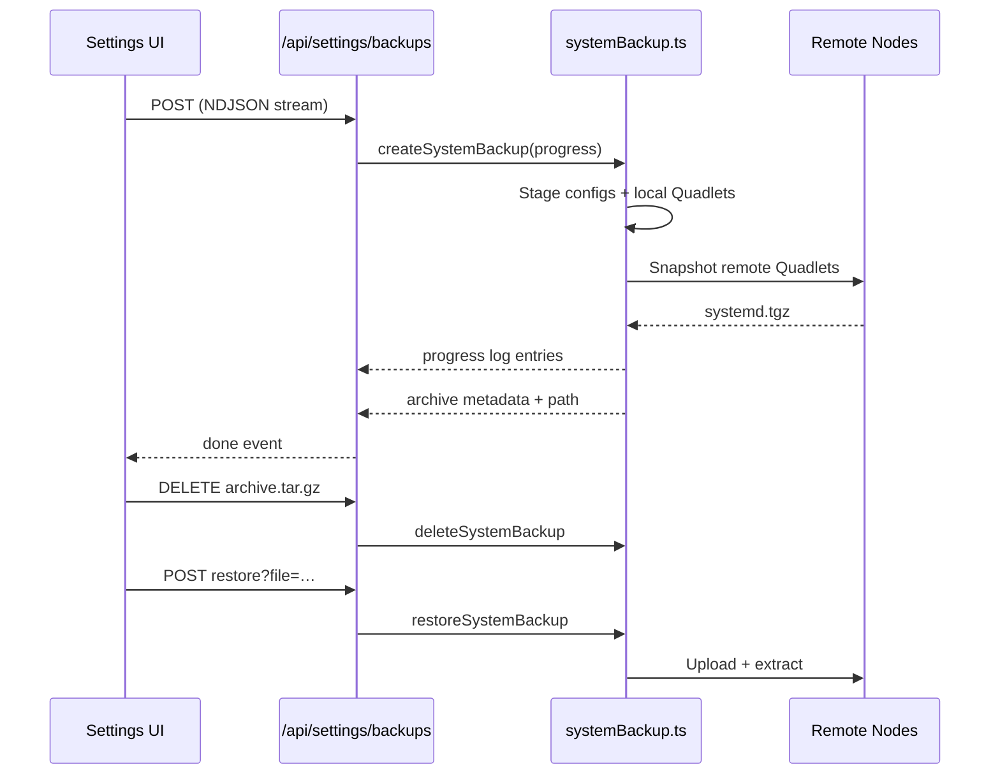

# Architecture (Target V4.1 - Reactive Digital Twin)

## Overview

ServiceBay is a Next.js application designed to manage containerized services using Podman. It provides a web interface for creating, monitoring, and managing services defined as Kubernetes Pod YAMLs (Quadlet style).

**Version 4.1 Architecture** moves to a **Reactive Digital Twin** model. This design eliminates polling and user-waiting times by maintaining an always-in-sync "Digital Twin" of the node state in the backend.

### Core Principles

*   **Push-Based**: The Agent pushes state changes (Files, Services, Containers) to the Backend immediately upon detection.
*   **Digital Twin**: The Backend maintains a real-time copy of the node's state. The UI reads only from this local cache (Store).
*   **Rootless Compatible**: All monitoring uses standard user-space tools available to the non-root user (`systemctl --user`, `podman`, `inotify`).
*   **Abstracted Modularity**: Gateways and Proxies are "Peripheral Twins" that feed into a generic data model.

### Deployment Models
1.  **ServiceBay-First (FCOS)**: ServiceBay runs on Fedora CoreOS as a rootless user service (`core` user). It acts as the primary orchestrator for the node.
2.  **Standalone**: ServiceBay runs as a container on an existing Linux distro (Debian, Ubuntu, etc.).

## Architecture Diagram



## The Digital Twin Data Model

The Backend Store serves as the Single Source of Truth. It aggregates data from multiple sources into a generic model.

```typescript
interface DigitalTwinStore {
  // Core Node State (Pushed by Python Agent)
  nodes: Record<string, {
    connected: boolean;
    lastSync: number;
    resources: SystemResources; // CPU, RAM
    containers: EnrichedContainer[]; // Ports, Status, etc.
    services: ServiceUnit[]; // Systemd Units
  }>;

  // Abstract Peripheral: Internet Gateway (Polled by Backend)
  gateway: {
    provider: 'fritzbox' | 'unifi' | 'mock';
    publicIp: string;
    upstreamStatus: 'up' | 'down';
    lastUpdated: number;
  };

  // Abstract Peripheral: Reverse Proxy (Pushed by Agent via Inspector)
  proxy: {
    provider: 'nginx' | 'traefik' | 'caddy';
    routes: Array<{
      host: string;
      targetService: string; // e.g., "immich"
      targetPort: number;
      ssl: boolean;
    }>;
  };
  
  // App Configuration
  config: {
    templateSettings: Record<string, string>; // e.g. { DATA_DIR: "/mnt/data" }
  };
}
```

## Component Details

### A. The Agent (State Aggregator)
A single lightweight Python script (`src/lib/agent/v4/agent.py`) running on the target host. It acts as the "Digital Twin" source of truth, optimizing data collection to minimize system load while ensuring real-time responsiveness.

## Data Lineage & Visualization

The system flows data from the raw source (Linux Host) through the Backend Aggregator to the Frontend visualization.

### 1. Data Flow Diagram



### 2. Object Mapping
| Layer | Object Name | Description | Key Properties |
|-------|-------------|-------------|----------------|
| **Agent** | `EnrichedContainer` | Normalized Podman Container | `Id`, `State`, `Ports` (ss-merged), `Labels`, `Pid` |
| **Agent** | `ServiceUnit` | Systemd Service Status | `unit`, `activeState`, `subState`, `path` |
| **Backend** | `NodeTwin` | In-Memory Node State | `containers[]`, `services[]`, `files{}`, `resources` |
| **API** | `NetworkNode` | Graph Node Representation | `id`, `type`, `ports`, `rawData`, `metadata` |
| **API** | `rawData` | **Context Injection** | Contains the full source objects (`container`, `service`) attached to the graph node for UI consumption. |

### 3. Transformation Logic
1.  **Collection**: Agent runs `podman ps --format json` and `ss -tulpnH`. It merges PID ports into the container object to handle Host Network mode.
2.  **Sync**: Agent pushes the full state to `AgentHandler`, which updates `DigitalTwinStore.nodes[nodeID]`.
3.  **Graph Generation**: `NetworkService` reads the Store. It creates `NetworkNode` objects (e.g., "nginx", "immich").
4.  **Enrichment**: Crucially, `NetworkService` injects the original `NodeTwin.container` and `NodeTwin.service` objects into `NetworkNode.rawData`.
5.  **Visualization**: `ServiceMonitor` reads `rawData.container.Image` or `rawData.service.activeState` to display detailed runtime info without needing extra API calls.

#### 1. Agent Components

| Component | Trigger | Role & Data Provided |
| :--- | :--- | :--- |
| **Podman Monitor** | `podman events` (Stream) | **Role**: Tracks runtime state of containers.<br>**Trigger**: Real-time event stream with **1s Debounce**. Ignores noisy events (`exec`, `cleanup`).<br>**Data**: `containers[]` (State, Networks, Mounts, Labels). Correlates host ports via `ss` to mapped internal ports. |
| **Systemd Monitor** | Event-Driven | **Role**: Tracks Managed Kube Services (Podman Kube Stacks).<br>**Trigger**: Triggered by File changes or Container lifecycle events.<br>**Data**: `services[]` (ActiveState, SubState, Flags: `isReverseProxy`). |
| **File Watcher** | Hybrid | **Role**: Monitors config files for hot-reloads.<br>**Trigger**: Current: Efficient Polling (2s). Target: `inotify` events.<br>**Inputs**: `~/.config/containers/systemd/` + Dynamic Nginx mount paths.<br>**Data**: `files{}` (Content, timestamp). Sends raw content of `*.conf`, `*.yaml` for the editor. |
| **Nginx Inspector** | On-Change | **Role**: Extracts *actual* routing table from the active proxy.<br>**Mechanism**: Execs a shell script inside the `nginx` container to dump internal config.<br>**Data**: `proxy[]` (`host`, `targetService`, `targetPort`, `ssl`). |
| **Resource Monitor** | Polling (5s) | **Role**: Tracks system health and hardware stats.<br>**Trigger**: Polls system files (`/proc/*`) every 5s. Pushes updates **only** if metrics change beyond threshold.<br>**Data**: `resources` (CPU Load, RAM Usage/Total, Disk Usage, OS Release info). |

#### 2. Agent Data Flow



#### 3. Traffic Optimization (Deduplication)
To minimize SSH bandwidth and Backend processing, the Agent applies strict filtering before sending data:
*   **Event Debouncing**: Burst events (e.g., stack startup) are grouped into a single scan using a 1-second settling timer.
*   **Noise Filtering**: High-frequency, irrelevant events (like `exec_create` from healthchecks) are dropped immediately.
*   **Payload Deduplication**: The Agent caches the last pushed state for every component (Services, Files, etc.). A `SYNC_PARTIAL` message is **only** generated if the new JSON payload differs from the previous one.

### B. The Backend (Gateway Poller)
*   **Goal**: Monitor Internet connectivity.
*   **Mechanism**: A scheduled task (e.g., every 60s) runs in the Backend.
*   **Abstraction**: A `GatewayProvider` interface allows different implementations (FritzBox, Ubiquiti, etc.) to feed the same `gateway` state in the Store.

## Backend API Reference

The Backend exposes a set of standard REST APIs for the Frontend. These APIs primarily interact with the **Digital Twin Store** for reading data, and the **Agent Executor** for writing/actions.



### Core Endpoints

#### 1. Containers
*   `GET /api/containers`: Returns a list of all containers on a node.
    *   **Source**: Digital Twin Store (Memory).
    *   **Response**: `EnrichedContainer[]`.
*   `GET /api/containers/[id]`: Returns detailed inspection data.
*   `POST /api/containers/[id]/action`: Performs lifecycle actions.
    *   **Actions**: `start`, `stop`, `restart`, `delete`, `kill`.
    *   **Mechanism**: Direct RPC via Agent (`podman <action> <id>`).

#### 2. Services (Systemd)
*   `GET /api/services`: Returns managed services.
    *   **Source**: Backend Aggregator (Store + Config).
    *   **Logic**: Merges systemd units (from Agent) with Configured Links and Gateway status.
    *   **Special Types**: `gateway` (Internet Router), `link` (External Dashboard), `service` (Quadlet).

#### 3. Monitoring
*   `GET /api/monitoring`: Returns health check results.
    *   **Source**: Monitoring Store (In-Memory Ring Buffer).

### 4. Terminal (SSH Passthrough)
*   **Goal**: Provide a fully functional shell interface to the target node directly in the browser.
*   **Architecture**:
    *   **Frontend**: `xterm.js` + `xterm-addon-fit`. Handles VT100 emulation and keystrokes.
    *   **Transport**: Socket.IO bi-directional stream (`term-input` -> `term-output`).
    *   **Backend**: `AgentExecutor` spawns a persistent SSH shell session using `ssh2` Client.
    *   **Security**: Restricted to authenticated users. SSH session runs as the configured rootless user.

### 5. Network Graph Aggregation
*   **Goal**: Visualize the relationships between Nodes, Services, and the Internet.
*   **Mechanism**: `NetworkService.getGraph()` aggregates data from three layers on-demand:
    1.  **Infrastructure Layer**: Gateway (Router) status and Internet connectivity.
    2.  **Config Layer**: Application Settings (External Links, Manual Edges).
    3.  **Digital Twin Layer**: Real-time container state from the Agent.
*   **Logic**:
    *   Nodes are auto-discovered from `twin.services` and `twin.containers`.
    *   Edges are inferred from Nginx Proxy routes (`proxy_pass`) and DNS settings.
    *   The graph is "reactive" — as soon as the Agent pushes a container update, the graph acts as a derived view.

## Technology Decision: Python Agent

We have explicitly chosen **Python 3** (Standard Library only) over Bash/Shell scripts for the Agent implementation.

### Rationale
1.  **JSON Handling**: The entire V4 architecture relies on structured JSON streams. Python handles this natively.
2.  **Concurrency**: Managing multiple monitoring threads (DBus, Podman, File Watcher) in a single process is robust in Python.
3.  **Abstraction**: Python is the "Driver" that orchestrates the "Native Shell Scripts" (like the Nginx inspector), acting as the bridge between raw OS commands and the structured Backend API.

## System Backup Pipeline

ServiceBay includes a built-in configuration backup workflow implemented in `src/lib/systemBackup.ts`. The goal is to archive the full control-plane (config files + Quadlet manifests) for every managed node without duplicating user data volumes.

### Flow



### Key Behaviors

1. **Scoped Capture** – Only `config.json`, `nodes.json`, `checks.json`, and Quadlet-managed units are archived, keeping backups lightweight and fast.
2. **Multi-Node Awareness** – Remote nodes are contacted via the SSH connection pool. Each node is encoded in the metadata descriptor (name, scope, folder) so restores can target the exact same topology.
3. **Streaming Progress** – `createSystemBackup` emits structured log entries (scope, status, node) so the UI can display per-node progress and failures in real time via an NDJSON stream.
4. **Metadata File** – Every archive includes `metadata.json` describing version, creation timestamp, included config files, and node descriptors. Restores fall back to folder names if metadata is unavailable.
5. **Restore Safety** – Local Quadlets are copied directly; remote nodes receive a temporary tarball that is extracted into `$HOME/.config/containers/systemd` followed by `systemctl --user daemon-reload`. Errors are surfaced with precise node attribution.
6. **Lifecycle Management** – Users can delete stale archives through the same API, and the server validates requested filenames to prevent path traversal.

> The backup system is intentionally decoupled from application data volumes. Operators should combine these archives with their existing storage backups for a complete disaster-recovery story.

## Plugin Architecture

The dashboard (`/`) is built using a modular plugin architecture. This allows for easy extension of the dashboard with new features without cluttering the main page logic.

### Core Concepts

- **Plugin Components**: Each dashboard surface lives in `src/plugins/*.tsx` and can be imported independently by the route pages.
- **Navigation Registry**: `src/components/Sidebar.tsx` exports the plugin metadata array that is also shared with the mobile navigation.

### Current Plugins

1.  **Services**: Manages the core "containered services" (systemd units).
2.  **Containers**: Lists all active Podman containers.
3.  **Monitoring**: Real-time health checks, history, and notifications.
4.  **Network Map**: Visualizes service relationships.
5.  **System Info**: Displays CPU, Memory, OS, Network, Disk Usage.
6.  **SSH Terminal**: A fully functional web-based terminal using `xterm.js`.
7.  **Settings**: Application settings and ServiceBay updates.

## Registry & Installation

- **Local Registry**: Templates are read from `templates/` and `stacks/` directories.
- **Templates**: Are primarily **Kubernetes Pod YAMLs**.
- **Installation Flow**:
    1. The Installer modal renders templates with Mustache using the variables provided by the user and submits the resulting YAML + Quadlet payload to `/api/services`.
    2. `ServiceManager.deployKubeService()` writes the rendered files to `~/.config/containers/systemd/` through the Agent on the selected node.
    3. `ServiceManager` reloads the user-level systemd daemon and attempts to start the new unit.

## Testing Strategy

The project employs a robust testing strategy ensuring reliability across the Agent-Backend boundary.

### 1. Robustness & Resilience (Circuit Breaker)
*   **Agent Stream Protocol**: The backend implements a "Circuit Breaker" pattern for the JSON stream received from the Python Agent.
    *   **Logic**: If the stream contains consecutive malformed packets (binary garbage, syntax errors) exceeding a threshold, the connection is forcibly terminated to protect backend resources.
    *   **Recovery**: The Agent logic includes auto-reconnection backoff.
*   **Store Validation**: The Digital Twin Store acts as a guarded boundary. All updates entering the store are runtime-validated for correct top-level types (e.g., ensuring `containers` is an Array) to prevent frontend crashes due to corrupted state.

### 2. Backend Unit & Integration Tests
*   **Vitest** is used for all backend testing.
*   **Mocking**: External system dependencies (`fs`, `ssh2`, `child_process`) are heavily mocked to test logic in isolation.
*   **Key Test Suites**:
    *   `tests/backend/agent_robustness.test.ts`: Verifies connection stability under "fuzzing" conditions.
    *   `tests/backend/store_robustness.test.ts`: Verifies the Digital Twin's immunity to invalid payloads.
    *   `tests/backend/graph.test.ts`: Validates the aggregation logic for the Network Map.
    *   `tests/backend/api.test.ts`: Integration tests for key REST endpoints.

### 3. Frontend Component & Integration Tests
*   **Tools**:
    *   **Runner**: [Vitest](https://vitest.dev/) (with `jsdom` environment).
    *   **Library**: [React Testing Library (RTL)](https://testing-library.com/) for component rendering and interaction.
    *   **Mocking**: `vi.mock()` is used primarily to bypass the `useDigitalTwin` hook, injecting fixture data (Nodes, Containers, Gateway) directly into components.
*   **Philosophy**: "Integration over Implementation". Tests focus on what the user sees (rendering) and does (clicks/inputs), rather than internal state implementation.
*   **Key Test Scenarios**:
    *   **Core Visualization**: Verifies `ContainerList`, `ServicesPlugin` (Ports, Domains, Badges), and `NetworkPlugin` render correctly with mocked store data.
    *   **Logic & Mapping**: ensures complex logic in `ServicesPlugin` (like mapping Proxy Routes to Service Cards or identifying the Gateway) works as expected.
    *   **Interactive Forms**: Validates form inputs and submission payloads (e.g., `ServiceForm`).
    *   **Layout**: checks responsiveness (`MobileNav`, `Sidebar`).

## Tech Stack

- **Frontend**: Next.js 16 (App Router), React 19, Tailwind CSS.
- **Backend**: Node.js custom server.
- **Tunneling**: SSH (Client: `ssh2` or `openssh` binary).
- **Target**: Generic Linux with Podman & Systemd.
