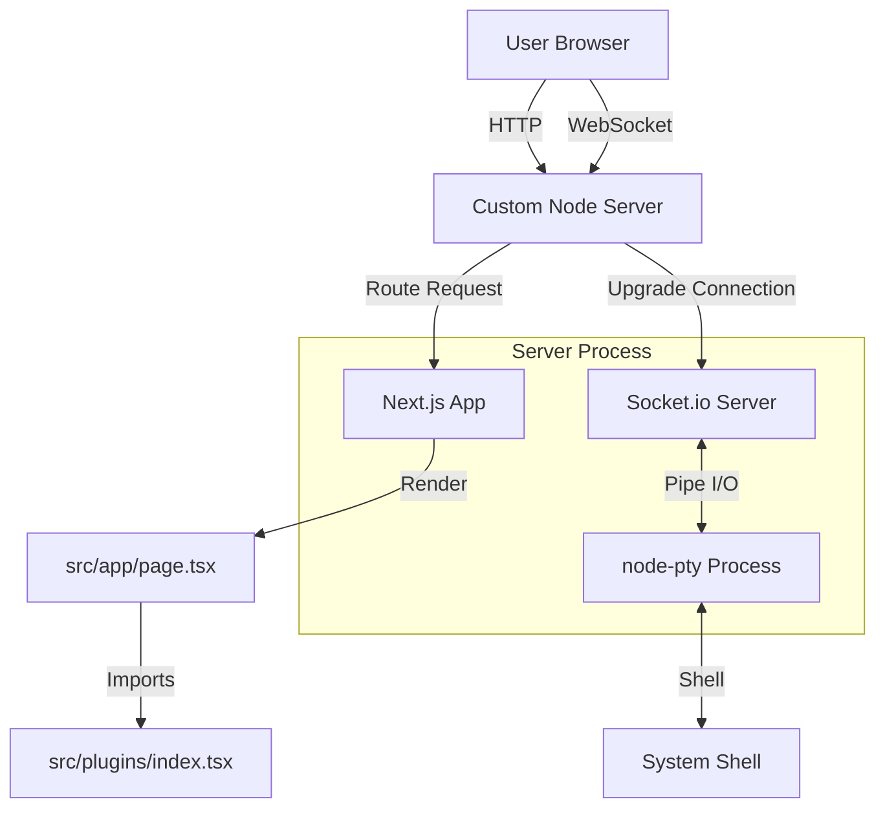

# Architecture

## Overview

ServiceBay is a Next.js application designed to manage containerized services using Podman. It provides a web interface for creating, monitoring, and managing services defined as Kubernetes Pod YAMLs (Quadlet style).

## Plugin Architecture

The dashboard (`/`) is built using a modular plugin architecture. This allows for easy extension of the dashboard with new features without cluttering the main page logic.

### Core Concepts

- **Plugin Interface**: Defined in `src/plugins/types.ts`.
  ```typescript
  export interface Plugin {
    id: string;
    name: string;
    icon: LucideIcon;
    component: ReactNode;
  }
  ```
- **Plugin Registry**: `src/plugins/index.tsx` exports an array of available plugins.
- **Layout**: The main page uses a two-column layout (Sidebar + Main Content) similar to the Registry browser.

### Current Plugins

1.  **Services**: Manages the core "containered services" (systemd units).
2.  **Running Containers**: Lists all active Podman containers.
3.  **System Info**: Displays CPU, Memory, OS, Network, and Disk Usage information.
4.  **System Updates**: Checks for available package updates (apt-based).
5.  **SSH Terminal**: A fully functional web-based terminal using `xterm.js` and `node-pty` over WebSockets.

### Server Architecture

To support the SSH Terminal (WebSockets), the application uses a custom Node.js server (`server.ts`) instead of the default Next.js server.

- **Entry Point**: `server.ts`
- **Technologies**: `http`, `socket.io`, `node-pty`, `next`.
- **Flow**:
  1.  HTTP requests are handled by Next.js.
  2.  WebSocket connections are handled by Socket.io.
  3.  Socket.io spawns a PTY process (bash/powershell) via `node-pty`.
  4.  Input/Output is piped between the browser (xterm.js) and the PTY process.

### Diagram



## Registry & Installation

- **Local Registry**: Templates are read from `templates/` and `stacks/` directories.
- **Installation Flow**:
  1.  User selects a Template or Stack.
  2.  `InstallerModal` opens.
  3.  User configures variables (Mustache templates).
  4.  Backend generates systemd unit and YAML files.

## Tech Stack

- **Frontend**: Next.js (App Router), React, Tailwind CSS.
- **Backend**: Next.js Server Actions & API Routes.
- **Container Engine**: Podman (via CLI).
- **System Integration**: `systemd` for service management.

## Plugin Guidelines

- **Navigation**: For complex views (e.g., Logs, Terminal, Detailed Info), always navigate to a new page (e.g., `/containers/[id]/logs`) instead of using overlays or modals. Overlays should be reserved for simple interactions like confirmation dialogs or small forms.

