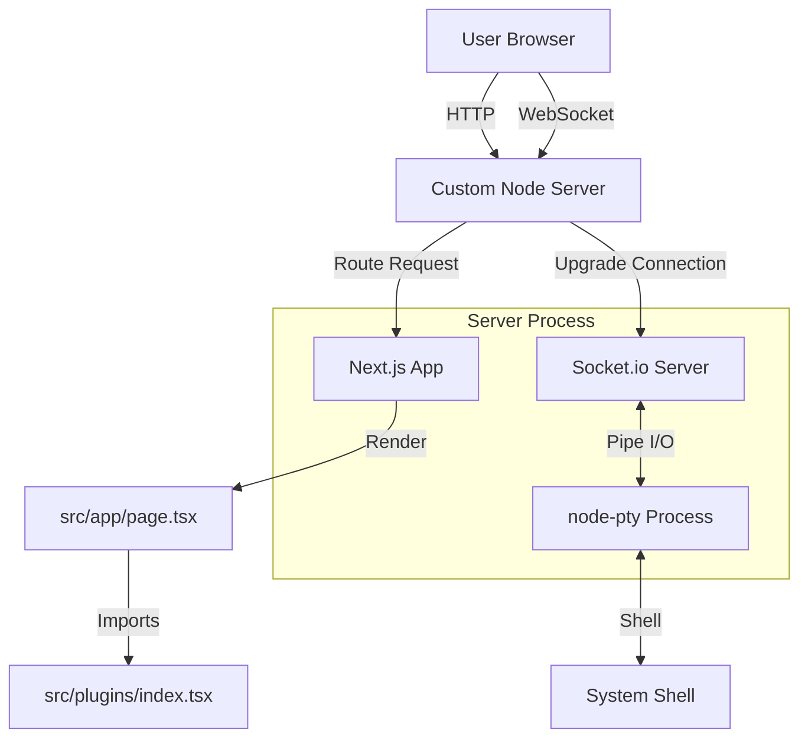

# Architecture

## Overview

ServiceBay is a Next.js application designed to manage containerized services using Podman. It provides a web interface for creating, monitoring, and managing services defined as Kubernetes Pod YAMLs (Quadlet style).

## Plugin Architecture

The dashboard (`/`) is built using a modular plugin architecture. This allows for easy extension of the dashboard with new features without cluttering the main page logic.

### Core Concepts

- **Plugin Interface**: Defined in `src/plugins/types.ts`.
  ```typescript
  export interface Plugin {
    id: string;
    name: string;
    icon: LucideIcon;
    component: ReactNode;
  }
  ```
- **Plugin Registry**: `src/plugins/index.tsx` exports an array of available plugins.
- **Layout**: The main page uses a responsive layout:
  - **Desktop**: Sidebar + Main Content.
  - **Mobile**: Top Bar + Main Content + Bottom Bar (`MobileNav.tsx`).

### Current Plugins

1.  **Services**: Manages the core "containered services" (systemd units).
2.  **Containers**: Lists all active Podman containers.
3.  **Monitoring**: Real-time health checks, history, and notifications.
4.  **Network Map**: Visualizes service relationships and health status using an interactive graph (React Flow + ELK).
5.  **System Info**: Displays CPU, Memory, OS, Network, Disk Usage, and OS Updates.
6.  **SSH Terminal**: A fully functional web-based terminal using `xterm.js` and `node-pty` over WebSockets.
7.  **Settings**: Application settings and ServiceBay updates.

### Server Architecture

To support the SSH Terminal (WebSockets), the application uses a custom Node.js server (`server.ts`) instead of the default Next.js server.

- **Entry Point**: `server.ts`
- **Technologies**: `http`, `socket.io`, `node-pty`, `next`.
- **Flow**:
  1.  HTTP requests are handled by Next.js.
  2.  WebSocket connections are handled by Socket.io.
  3.  Socket.io spawns a PTY process (bash/powershell) via `node-pty`.
  4.  Input/Output is piped between the browser (xterm.js) and the PTY process.

### Diagram



## Client Data Management

ServiceBay uses a custom caching layer (`src/providers/CacheProvider.tsx`) to manage client-side state efficiently.

### CacheProvider
- **Concept**: A global context that stores data key-value pairs (`key` -> `{ data, timestamp }`).
- **Hook**: `useCache<T>(key, fetcher, deps)`
  - **Stale-While-Revalidate**: Returns cached data immediately while fetching new data in the background.
  - **Deduplication**: Multiple components requesting the same key get the same data state.
  - **Validation**: Provides `validating` (background update) vs `loading` (no data) states.

### Shared Hooks (`useSharedData.ts`)
Common data sources like "Services List" and "Network Graph" are wrapped in specific hooks:
- `useServicesList()`: Aggregates services from all nodes (Local + Remote).
- `useNetworkGraph()`: Provides the raw graph data for visualization.

### User Feedback (Toast Notifications)
Data operations follow a strict notification pattern using `ToastProvider`:
1.  **Start**: `addToast('loading', ...)` (indefinite duration).
2.  **Success/Error**: `updateToast(id, ...)` to resolve the notification.
This ensures the user always knows when data is being refreshed, even if the UI doesn't blank out.

## Monitoring System

The monitoring system (`src/lib/monitoring/`) provides real-time health checks for services.

- **Gateway**: `MonitoringGateway` manages the active monitoring loop.
- **Discovery**: Automatically discovers targets from:
  - **Podman**: Containers.
  - **Services**: Managed systemd services.
  - **Manual**: User-defined external URLs.
- **Checks**: Supports HTTP (Status, Body Regex) and TCP (Port Open) checks.
- **History**: Stores check results in-memory with time-based bucketing for visualization.
- **Notifications**: Uses Socket.IO to push state changes (Up/Down) to the frontend in real-time.

## Registry & Installation

- **Local Registry**: Templates are read from `templates/` and `stacks/` directories.
- **Installation Flow**:
  1.  User selects a Template or Stack.
  2.  `InstallerModal` opens.
  3.  User configures variables (Mustache templates).
  4.  Backend generates systemd unit and YAML files.

## Update System

ServiceBay handles two types of updates:

### Application Updates
- **Location**: Settings Plugin.
- **Source**: GitHub Container Registry (`ghcr.io/mdopp/servicebay`).
- **Mechanism**: 
  1. Checks for new image tags on GHCR.
  2. Pulls the new image (`podman pull`).
  3. Triggers `podman auto-update` to restart the container with the new image.

### System Updates
- **Location**: System Info Plugin.
- **Source**: OS Package Manager (`apt`).
- **Mechanism**: Checks for available updates using `apt list --upgradable`.
- **Action**: Provides a copy-paste command for the user to run in the terminal (`sudo apt update && ...`).

## Installation

The installation is handled by `install.sh`, which:
1.  Checks for Podman.
2.  Creates a Quadlet file (`~/.config/containers/systemd/servicebay.container`).
3.  Reloads systemd to start the container.

The container is configured with:
- `AutoUpdate=registry`: Enables automatic updates via Podman.
- `UserNS=keep-id`: Maps the container user to the host user for SSH key access.
- Volume Mounts:
  - `~/.servicebay`: Persistent configuration.
  - `~/.ssh`: Read-only access to host SSH keys for remote management.
  - `/run/podman/podman.sock`: Access to host Podman socket (for self-updates).

## Tech Stack

- **Frontend**: Next.js 16 (App Router), React 19, Tailwind CSS.
- **Backend**: Next.js Server Actions & API Routes.
- **Server**: Custom Node.js server (`server.ts`) for WebSocket support.
- **Container Engine**: Podman (via CLI).
- **System Integration**: `systemd` for service management.

## Plugin Guidelines

- **Navigation**: For complex views (e.g., Logs, Terminal, Detailed Info), always navigate to a new page (e.g., `/containers/[id]/logs`) instead of using overlays or modals. Overlays should be reserved for simple interactions like confirmation dialogs or small forms.
- **Design**: Follow the [Design Principles](DESIGN_PRINCIPLES.md) for consistent UI/UX.

