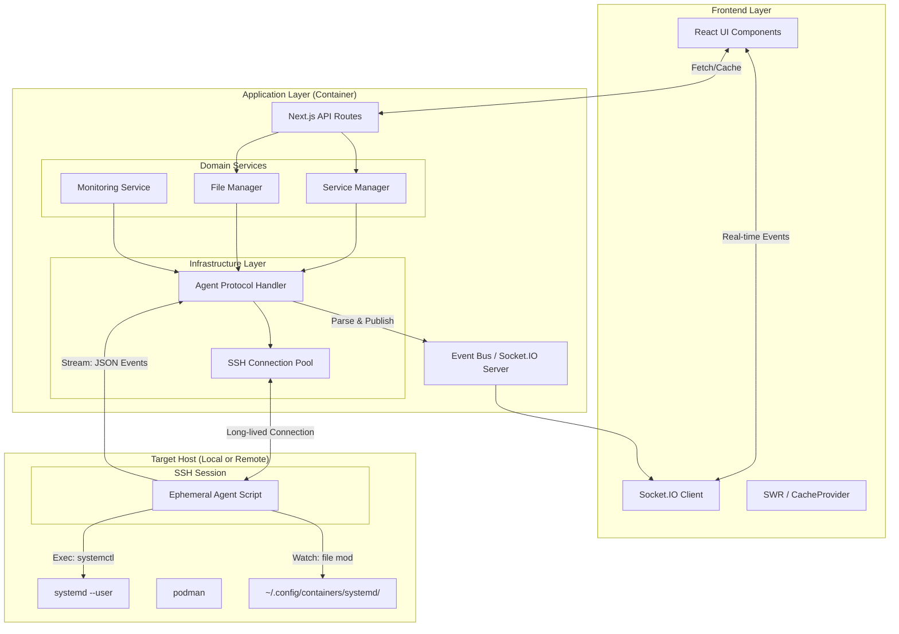

# Architecture (Target V4)

## Overview

ServiceBay is a Next.js application designed to manage containerized services using Podman. It provides a web interface for creating, monitoring, and managing services defined as Kubernetes Pod YAMLs (Quadlet style).

**Version 4 Architecture** moves away from direct filesystem access and synchronous CLI calls. It adopts a **Unified Agentless SSH Architecture**, where the "Local" node is treated identically to "Remote" nodes.

The core core abstraction for services is **Podman Kube Quadlets** (`.kube` files pointing to Kubernetes YAMLs), allowing for full-stack definitions in a single YAML file, managed by systemd. Standard Quadlet `.container` files are also supported.

## Core Architecture Principles

1.  **Unified Node Access**: All nodes (Local & Remote) are accessed via SSH. This ensures consistent behavior and isolates the ServiceBay container from the host OS.
2.  **Stateless Manager**: The backend does not maintain stateful watchers on files. Instead, it relies on the target host to push updates.
3.  **Ephemeral Agents**: We do not install daemons on the targets. We inject a temporary Bash/Python script into an active SSH session to stream events (File chnages, Service status, Logs).

## Architecture Diagram

## Plugin Architecture

The dashboard (`/`) is built using a modular plugin architecture. This allows for easy extension of the dashboard with new features without cluttering the main page logic.

### Core Concepts

- **Plugin Interface**: Defined in `src/plugins/types.ts`.
- **Plugin Registry**: `src/plugins/index.tsx` exports an array of available plugins.

### Current Plugins

1.  **Services**: Manages the core "containered services" (systemd units).
2.  **Containers**: Lists all active Podman containers.
3.  **Monitoring**: Real-time health checks, history, and notifications.
4.  **Network Map**: Visualizes service relationships.
5.  **System Info**: Displays CPU, Memory, OS, Network, Disk Usage.
6.  **SSH Terminal**: A fully functional web-based terminal using `xterm.js`.
7.  **Settings**: Application settings and ServiceBay updates.

## Infrastructure Layer

### SSH Connection Pool
To avoid the overhead of SSH handshakes (300ms+) for every action, ServiceBay maintains a pool of persistent SSH connections.
- **Multiplexing**: Commands are executed over existing sessions where possible.
- **Recovery**: Broken connections are automatically re-established.

### The Ephemeral Agent
When ServiceBay connects to a node, it pipes a lightweight script (Bash or Python) into `ssh user@host 'bash -s'`.
This script:
1.  **Loops** indefinitely, accepting commands from `stdin` (JSON).
2.  **Polls/Watches** critical paths (`.config/containers/systemd`) for changes.
3.  **Streams** `journalctl` output for active services.
4.  **Emits** events to `stdout` as JSON Lines.

## Client Data Management

ServiceBay uses a custom caching layer (`src/providers/CacheProvider.tsx`) to manage client-side state.
- **Optimistic UI**: Writes updates to cache immediately before confirmation.
- **Event-Driven**: Listens to WebSocket events from the `EventBus` to invalidate or update cache keys without polling.

## Registry & Installation

- **Local Registry**: Templates are read from `templates/` and `stacks/` directories.
- **Templates**: Are primarily **Kubernetes Pod YAMLs**.
- **Installation Flow**:
  1. Frontend sends configuration (Template + Variables).
  2. `UnitGenerator` creates:
     - `service.yml` (The K8s Pod definition).
     - `service.kube` (The Systemd Quadlet unit referencing the YAML).
  3. `FileManager` writes these files via SSH to `~/.config/containers/systemd/`.
  4. `ServiceManager` reloads the daemon.

## Tech Stack

- **Frontend**: Next.js 16 (App Router), React 19, Tailwind CSS.
- **Backend**: Node.js custom server.
- **Tunneling**: SSH (Client: `ssh2` or `openssh` binary).
- **Target**: Generic Linux with Podman & Systemd.

