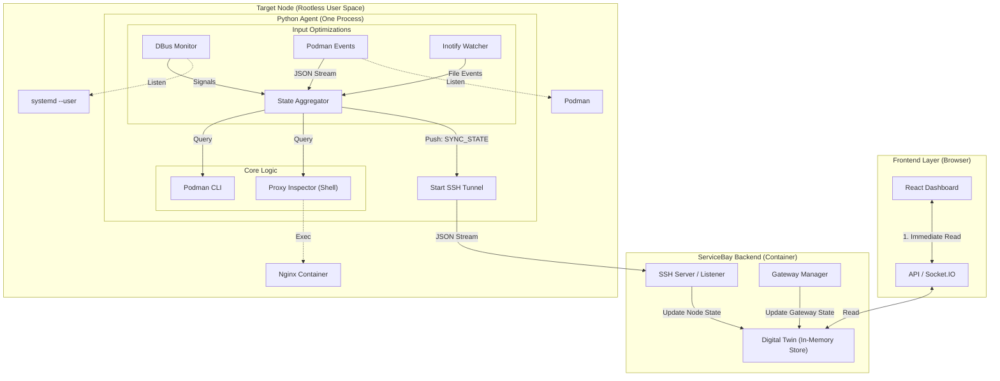

# ServiceBay V4 Agent-Based Architecture Proposed

Based on our analysis, here is the proposal for the **Reactive Digital Twin Architecture**. This design eliminates polling and user-waiting times by maintaining an always-in-sync "Digital Twin" of the node state in the backend.

## 1. High-Level Concept

*   **Push-Based**: The Agent pushes state changes (Files, Services, Containers) to the Backend immediately upon detection.
*   **Digital Twin**: The Backend maintains a real-time copy of the node's state. The UI reads only from this local cache (Store).
*   **Rootless Compatible**: All monitoring uses standard user-space tools available to the non-root user (`systemctl --user`, `podman`, `inotify`).
*   **Abstracted Modularity**: Gateways and Proxies are "Peripheral Twins" that feed into a generic data model, enabling easy plugin swapping (e.g., Traefik instead of Nginx, Unifi instead of FritzBox).

## 2. Architecture Diagram



## 3. The Digital Twin Data Model

The Backend Store serves as the Single Source of Truth. It aggregates data from multiple sources into a generic model.

```typescript
interface DigitalTwinStore {
  // Core Node State (Pushed by Python Agent)
  nodes: Record<string, {
    connected: boolean;
    lastSync: number;
    resources: SystemResources; // CPU, RAM
    containers: EnrichedContainer[]; // Ports, Status, etc.
    services: ServiceUnit[]; // Systemd Units
  }>;

  // Abstract Peripheral: Internet Gateway (Polled by Backend)
  gateway: {
    provider: 'fritzbox' | 'unifi' | 'mock';
    publicIp: string;
    upstreamStatus: 'up' | 'down';
    lastUpdated: number;
  };

  // Abstract Peripheral: Reverse Proxy (Pushed by Agent via Inspector)
  proxy: {
    provider: 'nginx' | 'traefik' | 'caddy';
    routes: Array<{
      host: string;
      targetService: string; // e.g., "immich"
      targetPort: number;
      ssl: boolean;
    }>;
  };
}
```

## 4. Component Details

### A. The Agent (State Aggregator)
A single lightweight Python script (Standard Lib) running on the target.

1.  **Service Monitoring**: `busctl --user monitor` (Real-time).
2.  **Container Monitoring**: `podman events --format json` (Real-time).
3.  **Port Monitoring**: Local `/proc/net/tcp` scanning (On-Change).
4.  **Peripheral Inspector (Proxy)**:
    *   **Goal**: Abstract Nginx internals from the Agent.
    *   **Mechanism**: The Agent injects/execs a lightweight shell script (`inspector.sh`) inside the proxy container.
    *   **Output**: The script outputs generic JSON: `[{"host": "app.lan", "target": "app:3000"}]`.
    *   **Benefit**: To support Traefik, just provide a `traefik_inspector.sh`. The Agent code remains unchanged.

### B. The Backend (Gateway Poller)
*   **Goal**: Monitor Internet connectivity.
*   **Mechanism**: A scheduled task (e.g., every 60s) runs in the Backend.
*   **Abstraction**: A `GatewayProvider` interface allows different implementations (FritzBox, Ubiquiti, etc.) to feed the same `gateway` state in the Store.

## 5. Technology Decision: Python Agent

We have explicitly chosen **Python 3** (Standard Library only) over Bash/Shell scripts for the Agent implementation.

### Rationale
1.  **JSON Handling**: The entire V4 architecture relies on structured JSON streams. Python handles this natively.
2.  **Concurrency**: Managing multiple monitoring threads (DBus, Podman, File Watcher) in a single process is robust in Python.
3.  **Abstraction**: Python is the "Driver" that orchestrates the "Native Shell Scripts" (like the Nginx inspector), acting as the bridge between raw OS commands and the structured Backend API.

### Addressing the "Dual Language" Concern
*   **Role**: Python is strictly for **Infrastructure Abstraction**.
*   **Target**: It runs on the *Remote Host*, where Node.js is likely missing but Python 3 is present.
*   **Safety**: No business logic resides in Python. It purely pumps events.

## 6. Implementation Roadmap (TODOs)

Use this list to guide the next development iteration.

### Phase 1: The Core Digital Twin
- [x] **Backend Store**: Create `src/lib/store/twin.ts`. Implement the `DigitalTwinStore` interface using a singleton pattern.
- [x] **Socket Protocol**: Define the `AgentMessage` types (`SYNC_FULL`, `SYNC_DIFF`, `HEARTBEAT`) in `src/lib/agent/types.ts`.
- [x] **SSH Receiver**: Update `server.ts` to accept incoming JSON streams from agents and route them to `store.update()`.

### Phase 2: The Python Agent
- [x] **Scaffold**: Create `src/lib/agent/v4/agent.py` with `threading` support.
- [x] **DBus Monitor**: Implement `class SystemdMonitor` using `subprocess.Popen(['busctl', ...])`.
- [x] **Podman Monitor**: Implement `class PodmanMonitor` using `subprocess.Popen(['podman', 'events', ...])`.
- [x] **State Aggregator**: Implement the logic to merge these streams and debounce updates (prevent flooding).

### Phase 3: Peripheral Twins (The Abstraction Layer)
- [x] **Proxy Inspector**:
    - [x] Create `templates/nginx-web/inspector.sh`: A shell script that runs *inside* Nginx to grep configs and output JSON routes.
    - [x] Update `agent.py`: Add capability to `podman exec` this script when Nginx container changes.
- [x] **Gateway Poller**:
    - [x] Refactor `src/lib/fritzbox` into a generic `GatewayProvider`.
    - [x] create `src/lib/gateway/poller.ts`: A `setInterval` loop that calls the provider and updates `store.gateway`.

### Phase 4: Frontend Integration
- [x] **Hooks**: Create `useDigitalTwin` hook that subscribes to Socket.IO and returns the Store state.
- [x] **Refactor**: Update `ContainerList.tsx` and `ServiceList.tsx` to use `useDigitalTwin` instead of `useSWR`.
- [x] **Cleanup**: Remove legacy `GET /api/containers` endpoints.

