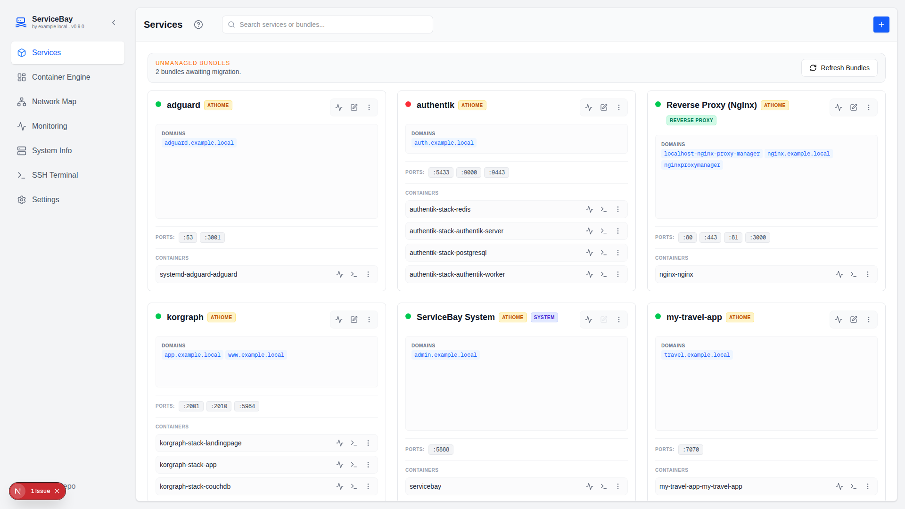
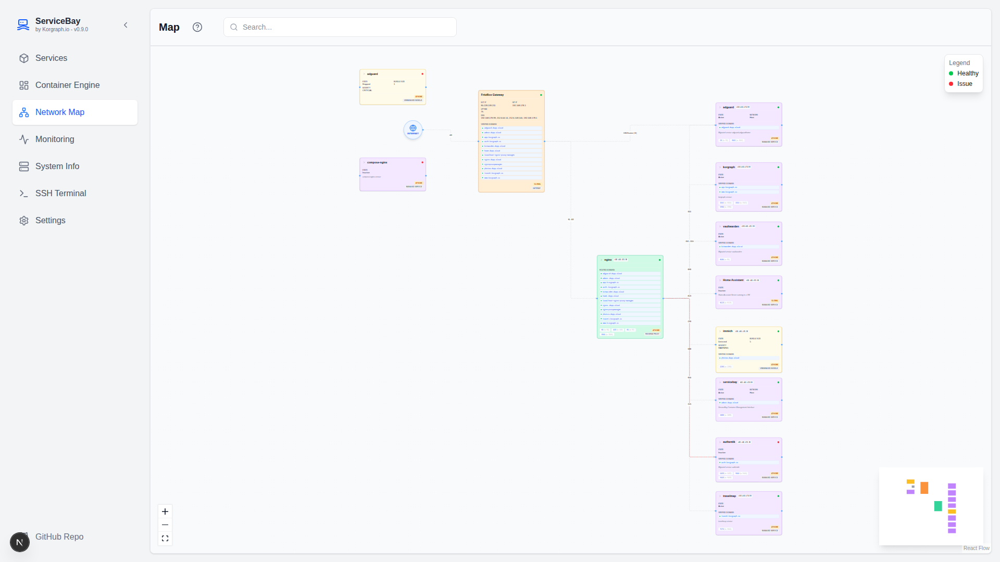
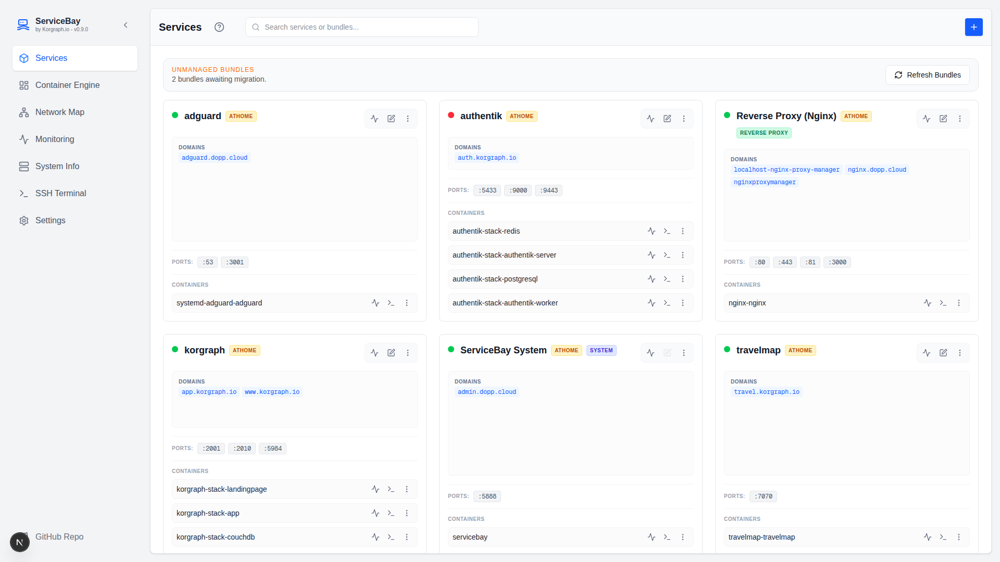
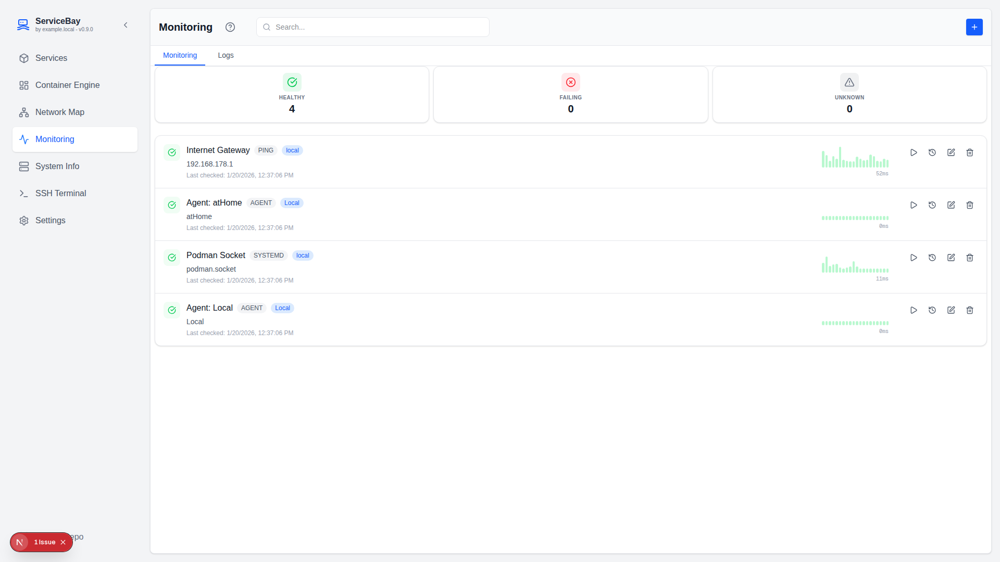
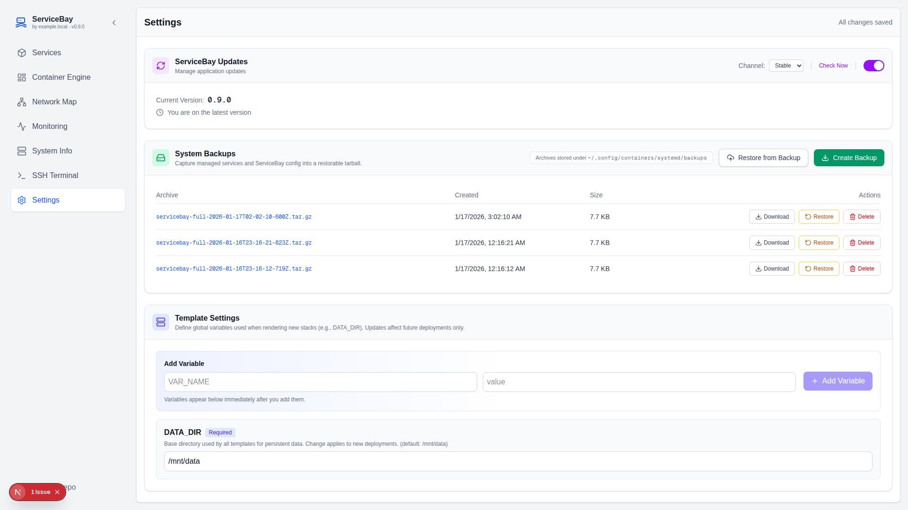
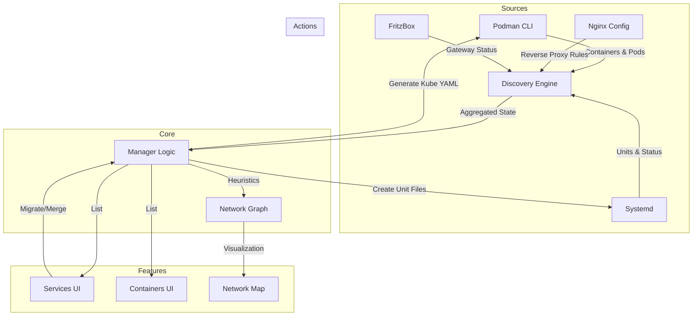

# ServiceBay

> **Modern, Web-First Container Management for Podman Quadlet**

ServiceBay is a **powerful web interface** designed to simplify management of containerized applications using Podman and Quadlet (systemd integration). It transforms complex container orchestration into an intuitive, visual experience—perfect for homelab enthusiasts, small teams, and self-hosted deployments.

## 🎯 What is ServiceBay?

ServiceBay acts as a **unified control center** for your Podman containers and systemd services. Instead of juggling SSH terminals and manual YAML editing, you get:

- **Visual Dashboard**: See all your containers, services, and their health status at a glance.
- **Network Topology**: Understand how your services communicate through an interactive architecture diagram.
- **One-Click Deployment**: Launch complex multi-container stacks from templates without writing YAML.
- **Real-Time Monitoring**: Track performance metrics, health checks, and system resources in real-time.
- **Multi-Node Management**: Manage containers across multiple machines via SSH—single pane of glass for your entire infrastructure.

## 🚀 Why Use ServiceBay?

### For Homelab Enthusiasts
- **No Kubernetes Complexity**: Get container orchestration without the overhead. Perfect for Docker Compose-like workflows but with Podman's security advantages.
- **Systemd Integration**: Containers run as first-class systemd services—survive reboots, integrate with your OS naturally.
- **Visual Network Maps**: See how your services (Home Assistant, Nginx, Immich, etc.) connect without digging through configs.

### For Self-Hosted Deployments
- **Infrastructure as Code**: Define stacks with reusable templates, deploy across multiple machines consistently.
- **Health Monitoring**: HTTP/TCP checks with history and alerts—know when services go down *before* your users do.
- **Automated Backups**: Snapshot your entire infrastructure state and restore with one click.
- **SSH-First Architecture**: Manage remote nodes securely; no exposed APIs, no VPN required.

### For DevOps & Automation
- **Template Registry**: Community stacks for Nginx, Redis, PostgreSQL, and more—reduce boilerplate.
- **YAML Editor**: Real-time validation, syntax highlighting, and live preview of your configurations.
- **Reverse Proxy Management**: Visualize and manage Nginx proxy rules directly from the UI.
- **System Info & Updates**: Monitor OS resources and keep your infrastructure up-to-date automatically.

## ✨ Key Features

- **Dashboard**: List and manage services in `~/.config/containers/systemd/` with real-time status.
- **Infrastructure-as-Code**: Reusable stacks with `{{DATA_DIR}}` and custom template variables.
- **Network Visualization**: Interactive, auto-layout diagram of your entire service architecture.
- **Health Monitoring**: Continuous HTTP/TCP checks with history graphs and smart alerts.
- **Service Registry**: Browse and deploy from a curated GitHub template registry.
- **YAML Editor**: Create/edit services with real-time validation and hot-reload.
- **System Resources**: View CPU, RAM, Disk, and manage OS updates (Fedora CoreOS native).
- **Web-Based Terminal**: SSH into nodes directly from the browser.
- **Multi-Node Backups**: Snapshot configs across all managed nodes and restore in seconds.
- **Mobile-First Design**: Full responsive UI with dedicated mobile navigation.
- **Auto-Updates**: Keep ServiceBay and containers current with a single click.
- **Rocket-Fast UX**: Overlay modals with proper z-index, ESC key navigation, and smooth animations.

## 📋 Real-World Use Cases

### 🏠 Home Media Server
Run Plex, Jellyfin, or Kaleido—see them in one dashboard, configure reverse proxy rules through the UI, monitor CPU/RAM usage, and set up health checks to alert if your media service goes down.

### 🔐 Privacy-First Personal Cloud
Host Nextcloud, Immich, Vaultwarden—ServiceBay lets you deploy all at once from templates, manage them centrally, and back up your entire config (though app data should use your own storage strategy).

### 🏢 Small Team Infrastructure
Manage staging/production services across multiple machines (home server, VPS, lab). Backup one node, restore on another. Real-time health monitoring ensures uptime without hiring DevOps.

### 🚀 Development Homelab
Quick prototyping with stacks (databases, caches, web servers). Deploy locally, then move to a VPS using the same YAML. See your entire tech stack in one visual diagram.

## 🎬 Quick Start (2 Minutes)

The fastest way to get ServiceBay running:

```bash
# One-liner for Linux with Podman
curl -fsSL "https://raw.githubusercontent.com/mdopp/servicebay/main/install.sh?$(date +%s)" | bash
```

That's it! Open [http://localhost:3000](http://localhost:3000) in your browser. The installer creates:
- ✅ A systemd service that survives reboots
- ✅ Persistent configuration in `~/.servicebay`
- ✅ SSH authentication with the host (for remote management)
- ✅ A random admin password (displayed at the end)

**Need production-grade setup?** Try [Fedora CoreOS installation](#1-fedora-coreos-recommended--production) for full immutable infrastructure.

---

## 📸 Screenshots

### Dashboard - Service Overview


*The main dashboard showing all managed services, their status, ports, and quick actions. Health check indicators show which services are online.*

### Network Map - Infrastructure Visualization


*Interactive graph showing how containers, services, and reverse proxy rules connect. Click any node to drill down into details.*

### Services Plugin - Container Management


*Manage Quadlet services with real-time systemd status. Deploy from templates, edit YAML configurations, and view live logs.*

### Monitoring - Health Checks


*Configure HTTP/TCP health checks for services. Track uptime history and receive alerts when services fail.*

### Settings - Multi-Node Management


*Add SSH nodes, configure template variables, manage backups, and control auto-update settings.*

> 💡 **Note**: Screenshots show ServiceBay v0.9.0 running on Fedora. The UI is fully responsive and works on mobile devices.
> 
> 🔧 **To generate screenshots**: Run `node scripts/capture-screenshots.js` while the dev server is running. See [docs/screenshots/README.md](docs/screenshots/README.md) for manual capture instructions.

---

## ⚡ Installation & Getting Started

```
┌─────────────────────────────────────────────────────────────────┐
│  ServiceBay Setup Flow                                          │
│                                                                 │
│  1️⃣  Run Installer        2️⃣  Configure Node        3️⃣  Launch UI
│  curl install.sh    →     Set SSH host/creds    →   :3000/login
│  (2 minutes)              (1 minute)                (Ready to use!)
│                                                                 │
│  ✨ SSH key auto-generated     ✅ Quadlet service created     │
│  ✨ Config in ~/.servicebay    ✅ Survives reboots          │
└─────────────────────────────────────────────────────────────────┘
```

## Installation

### 1. Fedora CoreOS (Recommended / Production)
This method installs a minimal, immutable OS where ServiceBay runs as a rootless system service (`servicebay.service`) and manages the entire node.

**Prerequisites:**
- `butane` (for transpiling config)
- `envsubst` (gettext package)
- `openssl`

1. **Run the Interactive Installer:**
   ```bash
   curl -fsSL "https://raw.githubusercontent.com/mdopp/servicebay/main/install-fedora-coreos.sh" | bash
   # Follow the prompts to configure IP, Secrets, and Data Paths.
   ```
   The script will generate an Ignition file (`install.ign`) in a `./build/fcos` directory and host it temporarily.

2. **Boot FCOS Installer:**
   Boot your target machine with the Fedora CoreOS installer ISO and run:
   ```bash
   coreos-installer install /dev/sda --ignition-url http://<YOUR_IP>:8000/install.ign
   ```

### 2. Standalone Container (Quick Start)
You can install ServiceBay on any Linux machine with Podman installed.

```bash
curl -fsSL "https://raw.githubusercontent.com/mdopp/servicebay/main/install.sh?$(date +%s)" | bash
```

This will:
1. Create a Quadlet container definition in `~/.config/containers/systemd/servicebay.container`.
2. Pull the latest Docker image from `ghcr.io/mdopp/servicebay`.
3. Start the container as a systemd service.
4. Generate SSH authentication for secure remote access.
5. Create initial configuration in `~/.servicebay`.

The installer will generate a random administrative password and display it at the end of the installation.

The web interface will be available at [http://localhost:3000](http://localhost:3000).

## 🖼️ UI Tour

### Dashboard
Your command center—see all containers and services at a glance:
- **Status Indicators**: Green (running), yellow (paused), red (stopped)
- **Quick Actions**: Start/stop/restart/remove from any card
- **Live Logs**: Tail container output in a persistent sidebar
- **Health Status**: See which services passed/failed health checks

### Network Map
Visualize your entire infrastructure topology:
- **Auto-Layout**: Containers and services arrange themselves intelligently
- **Connected Services**: See how Nginx proxy rules connect frontend → backend
- **Color-Coded Status**: Healthy nodes in green, degraded in yellow, offline in red
- **Click to Inspect**: View container details, port mappings, and environment variables

### Services Registry
Browse hundreds of pre-built service templates:
- **One-Click Deploy**: Install Nginx, PostgreSQL, Redis, Home Assistant, etc. without typing YAML
- **Variable Substitution**: Customize data directories, ports, and environment variables
- **Dependency Management**: Stack templates automatically set up networks and volume sharing

### Health Monitoring Dashboard
Set up HTTP/TCP health checks:
- **Real-Time Status**: Watch services come online and track uptime
- **History Graphs**: 30-day performance and availability data
- **Smart Alerts**: Notifications when services fail (integrates with your reverse proxy)
- **Custom Intervals**: Fine-tune check frequency per service

### Settings
- **Node Management**: Add remote machines (SSH), view connection status
- **Template Variables**: Set `{{DATA_DIR}}`, custom environment variables for all stacks
- **System Backups**: Archive all configs across nodes, restore in seconds
- **Auto-Update**: Toggle automatic container image updates
- **Authentication**: Manage admin credentials and SSH keys

## 📊 System Architecture

## 📊 System Architecture

ServiceBay runs entirely in a **containerized environment** and communicates with Podman hosts exclusively over SSH. This design ensures:

- **Security**: No exposed APIs; all communication is encrypted SSH
- **Isolation**: ServiceBay doesn't need Podman installed locally—it operates entirely through SSH
- **Multi-Node Ready**: Manage containers on your local machine and remote VPS/servers from a single web UI
- **Reliability**: SSH-based commands survive network hiccups and container restarts

### Control Flow
```
Browser (UI) 
    ↓
Next.js Server (Socket.IO) 
    ↓
Agent Handler (SSH connection pool) 
    ↓
Remote Node (SSH: Python agent → podman CLI)
```

The Python agent on each node responds to commands and pushes state updates back to ServiceBay, creating a **reactive, push-based** system rather than constant polling.

## 🔒 SSH-First, Containerized-Only Design

ServiceBay **exclusively uses SSH** for container management:

- **No Local Podman Required**: ServiceBay runs in a container and doesn't need Podman binaries installed locally
- **Multi-Machine Support**: Add any Linux machine with SSH access as a managed node
- **Automatic SSH Setup**: The installer generates and authorizes SSH keys automatically
- **Secure by Default**: Private keys stay on your machine; ServiceBay uses them to reach your infrastructure

### Example Setups
| Scenario | Setup | Benefit |
|----------|-------|---------|
| **Single Machine** | ServiceBay container + SSH to localhost | Boots after reboot, managed as systemd service |
| **Homelab + VPS** | ServiceBay on homelab + SSH to VPS | Monitor both locally and cloud infrastructure from one UI |
| **Multiple Remote Nodes** | ServiceBay anywhere + SSH to 3+ machines | Run on a small orchestrator machine, manage entire fleet |

## 🤔 ServiceBay vs. Other Tools

| Feature | ServiceBay | Portainer | Cockpit | Docker Desktop |
|---------|------------|-----------|---------|-----------------|
| **Web UI** | ✅ Modern, responsive | ✅ Full-featured | ✅ System-focused | ❌ Native app only |
| **Podman Support** | ✅ Quadlet-native | ✅ Via API | ✅ Systemd integration | ❌ Docker only |
| **Multi-Node** | ✅ SSH-based | ✅ Agent-based | ✅ Cockpit instances | ❌ Local only |
| **Templates/Stacks** | ✅ GitHub registry | ✅ Built-in | ⚠️ Limited | ⚠️ Docker Compose |
| **Health Monitoring** | ✅ HTTP/TCP checks | ⚠️ Basic logs | ⚠️ System metrics | ⚠️ Container logs |
| **Reverse Proxy** | ✅ Nginx visualization | ❌ | ✅ Firewall rules | ❌ |
| **Kubernetes** | ❌ Not needed | ✅ Supported | ❌ | ❌ |
| **Price** | 💚 Open Source | 💚 Open Source + paid | 💚 Open Source | 💛 Free for personal |
| **Best For** | Podman, systemd, homelabs | Large Docker/K8s ops | System admins | Docker developers |

---

## 📈 Performance & Reliability

- **Efficient Polling**: State updates come via SSH stream, not constant HTTP polling
- **Circuit Breaker**: Malformed agent responses don't crash the server
- **Graceful Degradation**: Missing SSH connections show clear error messages, not silent failures
- **Systemd Integration**: Services auto-restart after reboot, managed as first-class systemd units

## Data Persistence & File Structure

ServiceBay is designed to separate **Application State** from **User Data**.

| Path Type | Location (FCOS Default) | Description |
|-----------|-------------------------|-------------|
| **Config** | `~/.servicebay` | Stores `config.json`, `checks.json`, logs. |
| **Systemd** | `~/.config/containers/systemd` | Quadlet unit files (`.kube`, `.container`). |
| **Data** | `/mnt/data` (Configurable) | Persistent volume data for your stacks. |

**Template Settings:**
You can configure global variables like `DATA_DIR` in `Settings -> Template Settings`. These are automatically substituted in generic stack templates (e.g., `{{DATA_DIR}}/immich`).

**Backup Strategy:** Use **Settings → System Backups** to archive `~/.servicebay` plus every managed systemd stack (local + remote nodes). Persistent application data (your configured **Data** directory) should still be backed up using your preferred storage tooling.

## System Backups & Restore

ServiceBay ships with a first-class backup workflow that captures the critical configuration needed to recreate your managed environment.

1. **Scope**: The backup pipeline copies `config.json`, `nodes.json`, `checks.json`, and every managed Quadlet definition from the local node and each configured SSH node.
2. **Streaming Logs**: When you click **Create Backup**, the UI streams NDJSON progress logs so you can see when each node is scanned, archived, or skipped.
3. **Metadata**: Every archive stores metadata describing the captured nodes, versions, and included files to guarantee parity at restore time.
4. **Restore**: Choose any archive in **Settings → System Backups** to replay configs and redeploy Quadlet units across the same set of nodes.
5. **Housekeeping**: Delete stale archives directly from the UI once you have moved them to long-term storage.

> 💡 Only configuration/state files are included. Application volumes and other large data directories should still be handled by your regular storage strategy.

## Reverse Proxy Configuration

If you are running ServiceBay behind a reverse proxy (like Nginx or Nginx Proxy Manager), you **must** configure it to support WebSockets and disable buffering for Live Logs (Server-Sent Events) to work correctly.

### Nginx Proxy Manager (NPM)
1. Edit the Proxy Host.
2. Enable **Websockets Support** in the "Details" tab.
3. Go to the **Advanced** tab and add the following to "Custom Nginx Configuration":
   ```nginx
   proxy_buffering off;
   proxy_request_buffering off;
   proxy_cache off;
   proxy_read_timeout 86400;
   ```

### Standard Nginx
Add the following to your `location /` block:
```nginx
location / {
    proxy_pass http://localhost:3000;
    
    # Required for Live Logs (SSE)
    proxy_buffering off;
    proxy_request_buffering off;
    proxy_cache off;

    # Required for Terminal (WebSockets)
    proxy_http_version 1.1;
    proxy_set_header Upgrade $http_upgrade;
    proxy_set_header Connection "upgrade";
    
    # Standard Headers
    proxy_set_header Host $host;
    proxy_set_header X-Real-IP $remote_addr;
    proxy_set_header X-Forwarded-For $proxy_add_x_forwarded_for;
}
```

## ❓ Troubleshooting & FAQ

### Installation Issues

**Q: "Command not found: curl" or "Permission denied"**
- Ensure you have `curl` installed: `sudo apt install curl` (Debian/Ubuntu) or `sudo dnf install curl` (Fedora)
- Run the installer with appropriate privileges if needed (e.g., `sudo` for system-wide Podman)

**Q: Port 3000 is already in use**
- Change the port by editing the Quadlet file: `~/.config/containers/systemd/servicebay.container`
- Update the `-p 3000:3000` line to `-p 8080:3000` (or your preferred port)
- Run `systemctl --user daemon-reload` and `systemctl --user restart servicebay`

**Q: "Cannot connect to the Docker daemon"**
- ServiceBay requires rootless Podman. Enable it: `podman system migrate` or follow [Podman rootless setup](https://docs.podman.io/en/latest/markdown/podman.1.html#rootless-mode)

### SSH & Remote Access

**Q: "SSH connection refused" or "Cannot authenticate"**
- Verify SSH credentials in **Settings → Nodes**
- Check that your SSH key exists: `ls -la ~/.servicebay/data/ssh/id_rsa`
- Test SSH manually: `ssh -i ~/.servicebay/data/ssh/id_rsa user@host`
- Ensure the public key is in the remote user's `~/.ssh/authorized_keys`

**Q: How do I manage a remote VPS?**
1. In Settings, click **"Add Node"**
2. Enter `ssh://username@your-vps-ip`
3. Copy your ServiceBay SSH public key to the VPS: `cat ~/.servicebay/data/ssh/id_rsa.pub >> ~/.ssh/authorized_keys`
4. Click **"Check Health"** to verify connectivity

**Q: "Legacy local nodes are unsupported"**
- This means your `nodes.json` still has old `'local'` URI entries
- Edit Settings → Nodes → Edit the broken node
- Change URI to `ssh://your-username@127.0.0.1` (or your actual hostname)
- Re-run the installer if you need automatic setup: `curl -fsSL "https://raw.githubusercontent.com/mdopp/servicebay/main/install.sh" | bash`

### Services & Containers

**Q: "Service won't start" or "Container keeps restarting"**
- Check the service logs: `journalctl --user -u servicebay-myservice.kube -f`
- Verify your stack YAML is valid by editing it in the UI (real-time validation)
- Ensure volumes exist: `ls -la ~/.servicebay/data/`
- Check port conflicts: `lsof -i :8080` (replace with your port)

**Q: Health checks always fail**
- Verify the service is actually running: `podman ps`
- Check connectivity from ServiceBay container: `podman exec servicebay curl http://localhost:8080`
- Ensure your health check URL is correct (include port and path)
- Review check logs in **Monitoring → Health Checks**

### Performance & Monitoring

**Q: Dashboard loads slowly**
- Check system resources: **Settings → System Info**
- Reduce the number of active health checks if CPU is high
- For large deployments, consider running ServiceBay on a dedicated machine

**Q: Live logs aren't updating**
- Verify reverse proxy supports SSE (see [Reverse Proxy Configuration](#reverse-proxy-configuration))
- Check browser console for WebSocket errors (F12 → Console)
- Restart the service: `systemctl --user restart servicebay`

### Backups & Restore

**Q: Backup takes too long**
- Large deployments with many services take time to scan
- Streaming logs show progress—you can leave the UI open without worrying
- Backups run over SSH, so network latency affects speed

**Q: "Cannot restore: nodes differ"**
- Restore requires the same nodes configured when the backup was created
- If you want to move services to different nodes, manually import the relevant `.kube` files instead

### Updates & Upgrades

**Q: How do I update ServiceBay?**
- Go to **Settings → System → Check for Updates**
- Click **"Update"** to pull the latest image and restart
- This works seamlessly thanks to the SSH-based architecture (container can restart itself)

**Q: Do my containers get updated too?**
- Only ServiceBay updates automatically (if enabled in Settings)
- Your container services update based on your Quadlet image tags (`:latest` vs `:v1.2.3`)
- Use `systemctl --user stop servicename.kube` → edit file → `systemctl --user daemon-reload` → `systemctl --user start servicename.kube`

---

## Manual Development

First, run the development server:

```bash
npm run dev
```

Open [http://localhost:3000](http://localhost:3000) with your browser to see the result.

## Documentation

- [Architecture & Tech Stack](ARCHITECTURE.md)
- [Frontend Design Principles](DESIGN_PRINCIPLES.md)

## System Discovery & Data Flow

ServiceBay aggregates data from multiple sources to provide a unified view of your infrastructure.



### Discovery Logic
1. **Containers**: Fetched via `podman ps` and enriched with `podman inspect` for network details (Host vs Bridge).
2. **Services**: Scanned from `~/.config/containers/systemd/` (.kube files) and cross-referenced with active Systemd units.
3. **Network Map**:
   - **Nodes**: Created from Containers, Services, and External Devices.
   - **Edges**: Inferred from Nginx `proxy_pass` rules and Container Port mappings.
   - **Grouping**: Containers are automatically grouped into Pods or Services based on naming conventions (`service-name` -> `service-name-container`).

---

> **Note:** This project was completely **vibe-coded**. 🤙

## 🤝 Contributing & Community

ServiceBay is open-source and welcomes contributions! Whether you're fixing bugs, adding features, or improving documentation, here's how to get involved:

### Ways to Contribute
- **Bug Reports**: Found a crash or broken feature? [Open an issue](https://github.com/mdopp/servicebay/issues)
- **Feature Requests**: Have an idea? Describe it in [Discussions](https://github.com/mdopp/servicebay/discussions)
- **Code**: Submit a PR with your improvements (follow the [Contributing Guide](./CONTRIBUTING.md) if available)
- **Templates**: Create and share reusable service stacks via the template registry
- **Documentation**: Help improve READMEs, inline comments, and guides

### Development Setup
```bash
# Clone and install dependencies
git clone https://github.com/mdopp/servicebay.git
cd servicebay
npm install

# Run development server with auto-reload
npm run dev

# Run tests
npm run test

# Lint and format
npm run lint
npm run format
```

For detailed development info, see:
- [Architecture & Tech Stack](ARCHITECTURE.md)
- [Frontend Design Principles](DESIGN_PRINCIPLES.md)
- [Backend Instructions](.github/instructions/backend.instructions.md)

### Release & Versioning
ServiceBay uses **[Conventional Commits](https://www.conventionalcommits.org/)** and **Release Please** for automated releases:
- `feat:` → Minor version bump
- `fix:` → Patch version bump
- `feat!:` or `BREAKING CHANGE:` → Major version bump

See [Release Instructions](.github/instructions/release.instructions.md) for details.

## 📚 Learning Resources

- **[ServiceBay Docs](https://github.com/mdopp/servicebay/wiki)** - Community-maintained wiki
- **[Podman Docs](https://docs.podman.io/)** - Learn Podman and Quadlet
- **[Quadlet Systemd Integration](https://docs.podman.io/en/latest/markdown/podman-systemd.unit.5.html)** - Official Quadlet documentation
- **[Nginx Configuration](https://nginx.org/en/docs/)** - Reverse proxy setup

## 💬 Get Help

- **Discussions**: Ask questions in [GitHub Discussions](https://github.com/mdopp/servicebay/discussions)
- **Issues**: Report bugs with reproduction steps
- **Troubleshooting**: Check the [FAQ section](#-troubleshooting--faq) above

## 📄 License

ServiceBay is licensed under the [MIT License](LICENSE). See the file for details.

---

**Made with ❤️ for the homelab and self-hosted community.**

🚀 [Get Started Now](#-quick-start-2-minutes) | 📖 [Read the Docs](#-learning-resources) | 💬 [Join the Community](https://github.com/mdopp/servicebay/discussions)
