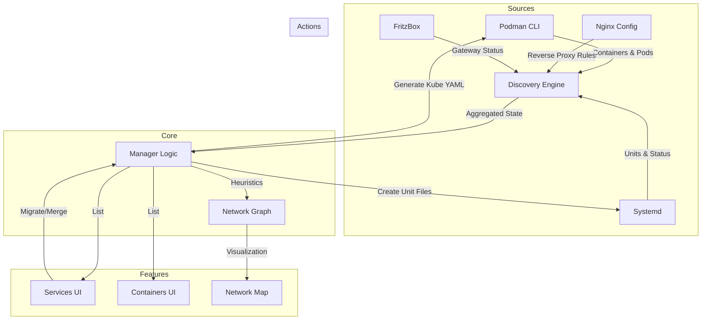

# ServiceBay

A Next.js web interface to manage Podman Quadlet services (Systemd).

## Features

- **Dashboard:** List and manage existing services in `~/.config/containers/systemd/`.
- **Infrastructure-as-Code:** Supports generic, reusable stacks via `{{DATA_DIR}}` and custom template variables.
- **Network Map:** Interactive visualization of your service architecture with auto-layout and health status.
- **Monitoring:** Real-time health checks (HTTP/TCP), history visualization, and smart notifications.
- **Registry:** Install services from a GitHub template registry.
- **Editor:** Create and edit services with real-time YAML validation.
- **System Info:** View server resources (CPU, RAM, Disk) and manage OS updates.
- **Terminal:** Integrated web-based SSH terminal.
- **Backups:** Multi-node configuration snapshots with streaming progress logs and one-click restore.
- **Mobile Ready:** Fully responsive design with dedicated mobile navigation.
- **Auto-Update:** Keep ServiceBay and your containers up to date.

## Installation

### 1. Fedora CoreOS (Recommended / Production)
This method installs a minimal, immutable OS where ServiceBay runs as a rootless system service (`servicebay.service`) and manages the entire node.

**Prerequisites:**
- `butane` (for transpiling config)
- `envsubst` (gettext package)
- `openssl`

1. **Run the Interactive Installer:**
   ```bash
   curl -fsSL "https://raw.githubusercontent.com/mdopp/servicebay/main/install-fedora-coreos.sh" | bash
   # Follow the prompts to configure IP, Secrets, and Data Paths.
   ```
   The script will generate an Ignition file (`install.ign`) in a `./build/fcos` directory and host it temporarily.

2. **Boot FCOS Installer:**
   Boot your target machine with the Fedora CoreOS installer ISO and run:
   ```bash
   coreos-installer install /dev/sda --ignition-url http://<YOUR_IP>:8000/install.ign
   ```

### 2. Standalone Container (Quick Start)
You can install ServiceBay on any Linux machine with Podman installed.

```bash
curl -fsSL "https://raw.githubusercontent.com/mdopp/servicebay/main/install.sh?$(date +%s)" | bash
```

This will:
1. Create a Quadlet container definition in `~/.config/containers/systemd/servicebay.container`.
2. Pull the latest Docker image from `ghcr.io/mdopp/servicebay`.
3. Start the container as a systemd service.

The installer will generate a random administrative password and display it at the end of the installation.

The web interface will be available at [http://localhost:3000](http://localhost:3000).

## Data Persistence & File Structure

ServiceBay is designed to separate **Application State** from **User Data**.

| Path Type | Location (FCOS Default) | Description |
|-----------|-------------------------|-------------|
| **Config** | `~/.servicebay` | Stores `config.json`, `checks.json`, logs. |
| **Systemd** | `~/.config/containers/systemd` | Quadlet unit files (`.kube`, `.container`). |
| **Data** | `/mnt/data` (Configurable) | Persistent volume data for your stacks. |

**Template Settings:**
You can configure global variables like `DATA_DIR` in `Settings -> Template Settings`. These are automatically substituted in generic stack templates (e.g., `{{DATA_DIR}}/immich`).

**Backup Strategy:** Use **Settings → System Backups** to archive `~/.servicebay` plus every managed systemd stack (local + remote nodes). Persistent application data (your configured **Data** directory) should still be backed up using your preferred storage tooling.

## System Backups & Restore

ServiceBay ships with a first-class backup workflow that captures the critical configuration needed to recreate your managed environment.

1. **Scope**: The backup pipeline copies `config.json`, `nodes.json`, `checks.json`, and every managed Quadlet definition from the local node and each configured SSH node.
2. **Streaming Logs**: When you click **Create Backup**, the UI streams NDJSON progress logs so you can see when each node is scanned, archived, or skipped.
3. **Metadata**: Every archive stores metadata describing the captured nodes, versions, and included files to guarantee parity at restore time.
4. **Restore**: Choose any archive in **Settings → System Backups** to replay configs and redeploy Quadlet units across the same set of nodes.
5. **Housekeeping**: Delete stale archives directly from the UI once you have moved them to long-term storage.

> 💡 Only configuration/state files are included. Application volumes and other large data directories should still be handled by your regular storage strategy.

## Reverse Proxy Configuration

If you are running ServiceBay behind a reverse proxy (like Nginx or Nginx Proxy Manager), you **must** configure it to support WebSockets and disable buffering for Live Logs (Server-Sent Events) to work correctly.

### Nginx Proxy Manager (NPM)
1. Edit the Proxy Host.
2. Enable **Websockets Support** in the "Details" tab.
3. Go to the **Advanced** tab and add the following to "Custom Nginx Configuration":
   ```nginx
   proxy_buffering off;
   proxy_request_buffering off;
   proxy_cache off;
   proxy_read_timeout 86400;
   ```

### Standard Nginx
Add the following to your `location /` block:
```nginx
location / {
    proxy_pass http://localhost:3000;
    
    # Required for Live Logs (SSE)
    proxy_buffering off;
    proxy_request_buffering off;
    proxy_cache off;

    # Required for Terminal (WebSockets)
    proxy_http_version 1.1;
    proxy_set_header Upgrade $http_upgrade;
    proxy_set_header Connection "upgrade";
    
    # Standard Headers
    proxy_set_header Host $host;
    proxy_set_header X-Real-IP $remote_addr;
    proxy_set_header X-Forwarded-For $proxy_add_x_forwarded_for;
}
```

## Manual Development

First, run the development server:

```bash
npm run dev
```

Open [http://localhost:3000](http://localhost:3000) with your browser to see the result.

## Documentation

- [Architecture & Tech Stack](ARCHITECTURE.md)
- [Frontend Design Principles](DESIGN_PRINCIPLES.md)

## System Discovery & Data Flow

ServiceBay aggregates data from multiple sources to provide a unified view of your infrastructure.



### Discovery Logic
1. **Containers**: Fetched via `podman ps` and enriched with `podman inspect` for network details (Host vs Bridge).
2. **Services**: Scanned from `~/.config/containers/systemd/` (.kube files) and cross-referenced with active Systemd units.
3. **Network Map**:
   - **Nodes**: Created from Containers, Services, and External Devices.
   - **Edges**: Inferred from Nginx `proxy_pass` rules and Container Port mappings.
   - **Grouping**: Containers are automatically grouped into Pods or Services based on naming conventions (`service-name` -> `service-name-container`).

---

> **Note:** This project was completely **vibe-coded**. 🤙
