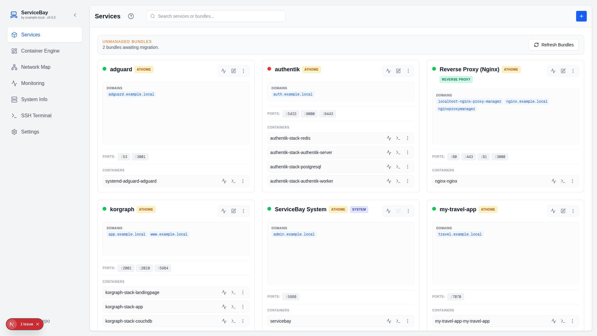
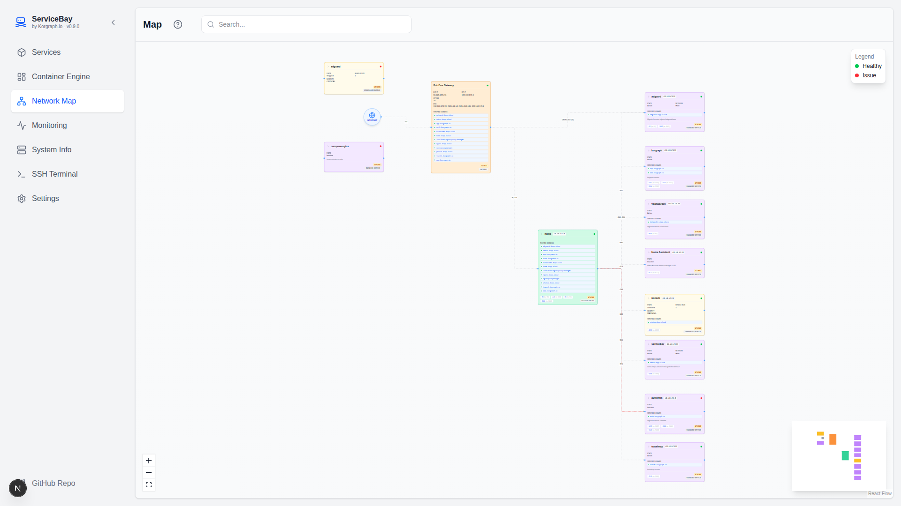
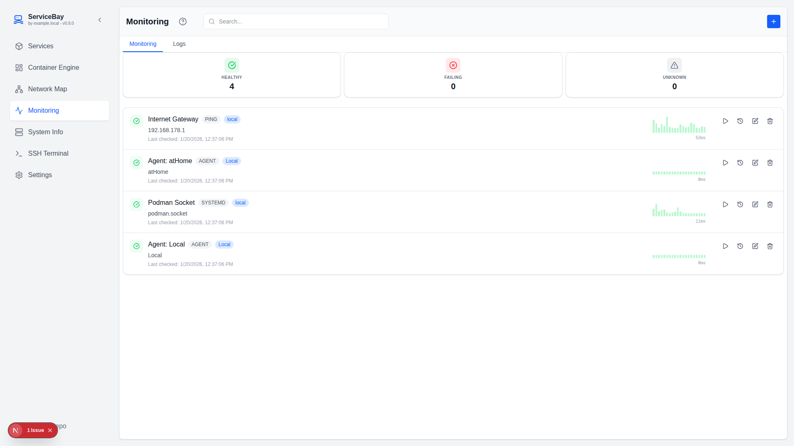

# ServiceBay

> **Web-First Container Management for Podman Quadlet**

ServiceBay is a web interface for managing containerized applications using Podman and Quadlet (systemd integration). It provides a visual dashboard, network topology, one-click deployments, real-time monitoring, and multi-node management over SSH.

## Screenshots

| Dashboard | Network Map | Monitoring |
|-----------|------------|------------|
|  |  |  |

## Quick Start

ServiceBay runs on **Fedora CoreOS** as an immutable, self-updating appliance. See the [Installation Guide](docs/INSTALLATION.md) for the full build pipeline, first-boot sequence, and configuration options.

```bash
./install-fedora-coreos.sh
```

The installer creates a bootable USB that provisions the entire system: OS, networking, ServiceBay container, SSH keys, and an admin account.

## Features

- **Service Dashboard** — manage Quadlet services in `~/.config/containers/systemd/` with real-time status
- **Network Visualization** — interactive topology diagram of services, containers, and proxy routes
- **Health Monitoring** — HTTP/TCP checks with history graphs and email alerts
- **Template Registry** — deploy Nginx, Redis, Home Assistant, Immich, etc. from GitHub-hosted templates
- **YAML Editor** — create/edit services with validation and hot-reload
- **Web Terminal** — SSH into any managed node from the browser
- **Multi-Node** — manage containers across machines via SSH from a single UI
- **System Backups** — snapshot all configs across nodes, restore in seconds
- **Auto-Updates** — keep ServiceBay and containers current automatically
- **Mobile-Responsive** — full UI with dedicated mobile navigation

## Architecture

ServiceBay uses a **Reactive Digital Twin** model: a Python agent on each managed node pushes state changes over SSH to the backend, which maintains an in-memory replica. The UI reads from this store — no polling.

```
Browser → Next.js + Socket.IO → SSH Connection Pool → Python Agent → Podman CLI
```

For the full architecture, data flow diagrams, and API reference, see **[docs/ARCHITECTURE.md](docs/ARCHITECTURE.md)**.

## Installation

| Method | Use Case | Guide |
|--------|----------|-------|
| **Fedora CoreOS** | Production, immutable OS | [docs/INSTALLATION.md](docs/INSTALLATION.md) |

The installer creates a rootless Podman container managed by systemd on an immutable Fedora CoreOS base. See the [Installation Guide](docs/INSTALLATION.md) for details.

## Reverse Proxy

If running behind Nginx, you **must** enable WebSockets and disable buffering:

```nginx
location / {
    proxy_pass http://localhost:3000;
    proxy_buffering off;
    proxy_cache off;
    proxy_http_version 1.1;
    proxy_set_header Upgrade $http_upgrade;
    proxy_set_header Connection "upgrade";
    proxy_set_header Host $host;
    proxy_set_header X-Real-IP $remote_addr;
    proxy_set_header X-Forwarded-For $proxy_add_x_forwarded_for;
}
```

For Nginx Proxy Manager: enable **Websockets Support**, then add `proxy_buffering off; proxy_cache off; proxy_read_timeout 86400;` in the Advanced tab.

## Development

```bash
git clone https://github.com/mdopp/servicebay.git && cd servicebay
npm install
npm run dev        # http://localhost:3000
npm test           # vitest
npm run lint       # eslint
```

## Troubleshooting

<details>
<summary><b>Port 3000 is already in use</b></summary>

Edit `~/.config/containers/systemd/servicebay.container`, change the port mapping, then:
```bash
systemctl --user daemon-reload && systemctl --user restart servicebay
```
</details>

<details>
<summary><b>SSH connection refused / Cannot authenticate</b></summary>

- Verify credentials in Settings → Nodes
- Test manually: `ssh -i /mnt/data/servicebay/ssh/id_rsa user@host`
- Ensure the public key is in the remote `~/.ssh/authorized_keys`
</details>

<details>
<summary><b>Service won't start / keeps restarting</b></summary>

```bash
journalctl --user -u servicename.kube -f   # check logs
podman ps -a                                 # check container state
```
</details>

<details>
<summary><b>Live logs / terminal not working</b></summary>

Your reverse proxy must support WebSockets and have `proxy_buffering off`. See [Reverse Proxy](#reverse-proxy) above.
</details>

<details>
<summary><b>How do I manage a remote VPS?</b></summary>

Settings → Add Node → `ssh://username@your-vps-ip`. Copy your ServiceBay SSH public key to the VPS's `~/.ssh/authorized_keys`.
</details>

<details>
<summary><b>How do I update ServiceBay?</b></summary>

Settings → System → Check for Updates → Update. Your service containers are independent — they update based on their image tags.
</details>

## Documentation

| Document | Content |
|----------|---------|
| [docs/ARCHITECTURE.md](docs/ARCHITECTURE.md) | System design, data flow, API reference, testing strategy, frontend design |
| [docs/INSTALLATION.md](docs/INSTALLATION.md) | Build pipeline, startup procedure, first-boot sequence, system modifications |
| [CHANGELOG.md](CHANGELOG.md) | Version history |

## Comparison

| Feature | ServiceBay | Portainer | Cockpit | Docker Desktop |
|---------|------------|-----------|---------|----------------|
| Podman Quadlet native | **Yes** | Via API | Systemd | No |
| Multi-Node (SSH) | **Yes** | Agent-based | Cockpit instances | Local only |
| Network Visualization | **Yes** | No | No | No |
| Health Monitoring | **Yes** | Basic | System metrics | Container logs |
| Template Registry | **Yes** | Built-in | Limited | Docker Compose |
| Open Source | **Yes** | Yes + paid | Yes | Free for personal |

## Contributing

- **Bug Reports**: [Open an issue](https://github.com/mdopp/servicebay/issues)
- **Discussions**: [GitHub Discussions](https://github.com/mdopp/servicebay/discussions)
- **Releases**: [Conventional Commits](https://www.conventionalcommits.org/) + Release Please. `feat:` → minor, `fix:` → patch, `feat!:` → major.

## License

[MIT License](LICENSE)
