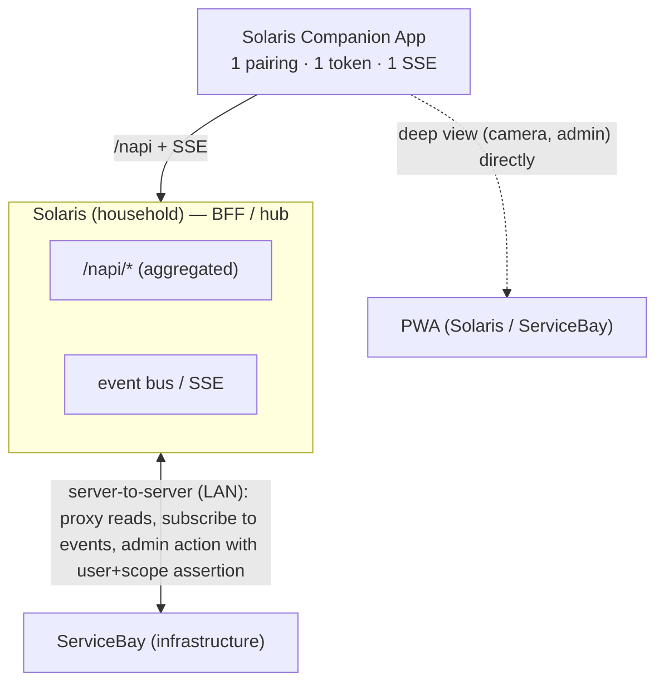

# ADR 0011 — App integrations aggregate server-side (Solaris as BFF/hub)

- **Status:** Accepted (2026-07-13)
- **Date:** 2026-07-13
- **Deciders:** @mdopp
- **Related ADRs:** [0009](adr-0009-service-tokens-and-trust.md) (service tokens & trust — the auth-delegation foundation this ADR builds on)

## Context

The Solaris companion Android app is deliberately a **thin, stable shell** (widgets + onboarding); the logic that changes lives server-side. App updates are expensive (sideload, versionCode). As the ServiceBay integration grows (approvals, service status, updates, access requests), the naive path would be a **multi-server app**: coupled to Solaris *and* ServiceBay, two tokens, two `/napi` surfaces, two realtime connections. That drives app complexity, auth surface, battery (several foreground SSE streams) and forces an app release per integration. ServiceBay already has a companion `/napi` (#2252: `/napi/approvals`, `/napi/home`) — the question: does the phone consume it directly, or does Solaris aggregate?

## Decision

- The app talks to **exactly one backend: the household's Solaris** — one pairing, one device token, one `/napi`, one realtime SSE.
- **Solaris is the backend-for-frontend / the hub**: it integrates ServiceBay **server-to-server** over the trusted LAN — proxies/aggregates ServiceBay reads under its own `/napi/…` and **republishes ServiceBay events on its event bus**, so the app gets everything over its *one* SSE connection.
- **Deep/live views** (camera stream, full admin screens) are **not** proxied — widget/app deep-link directly into the respective **PWA** (Solaris or ServiceBay).
- ServiceBay's companion `/napi` (#2252) is consumed by **Solaris** (server-to-server), not by the phone.
- **Mutating admin actions** (approve/reject, operate a service) require Solaris to act towards ServiceBay **as the authenticated admin user**: a **signed user+scope assertion** over a mutually authenticated server-to-server channel, verified by ServiceBay — builds on **[ADR 0009](adr-0009-service-tokens-and-trust.md) (service tokens & trust)**. That is the one hard part and gets its own specification.

## Consequences

- **The app stays thin:** a new integration = server work + maybe a widget; no new pairing/auth/multi-server code; fewer forced app updates.
- **One** auth model, **one** onboarding, **one** realtime connection (battery-friendly).
- Solaris takes on an aggregation responsibility (some domain coupling to ServiceBay's API) — acceptable: same owner, both auto-loop, the contract is server-to-server on the LAN.
- Auth delegation must be designed cleanly (avoid the confused deputy, ADR 0009). Read aggregation is trivial; mutations need the assertion.
- **Ticket impact:** solaris-android #41 (multi-server pairing) is dropped; #40–#45, #43, #50 run through Solaris.

## Related

ADR 0009 ([adr-0009-service-tokens-and-trust.md](adr-0009-service-tokens-and-trust.md) — service tokens & trust), `docs/COMPANION_APP.md`; solarisbay #757 (/napi), #2252 (companion /napi); solaris-android #40 (ServiceBay epic), #47 (realtime).
