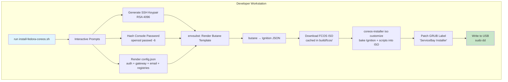
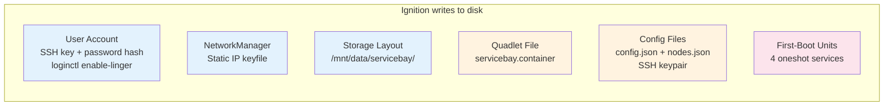
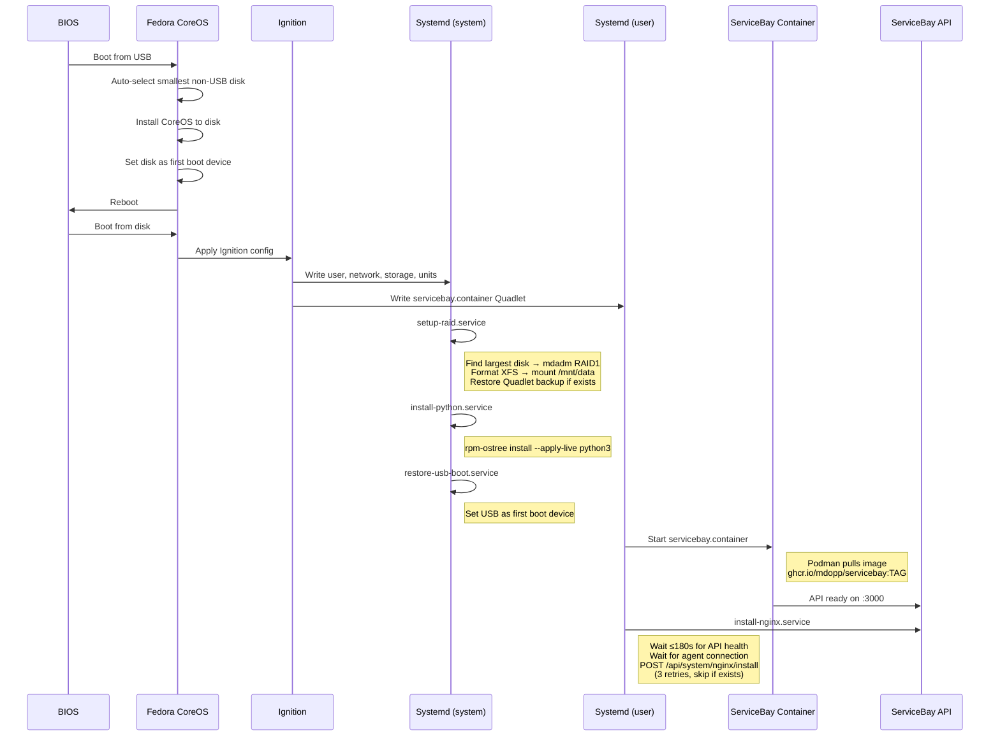
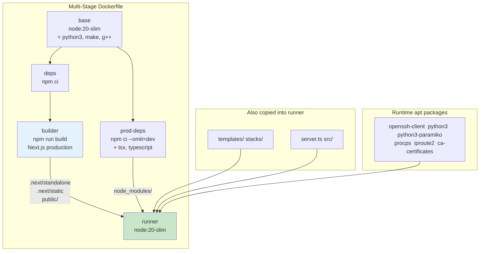
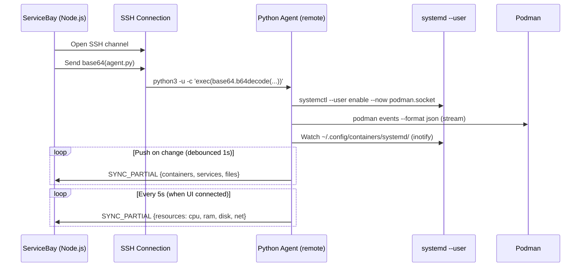
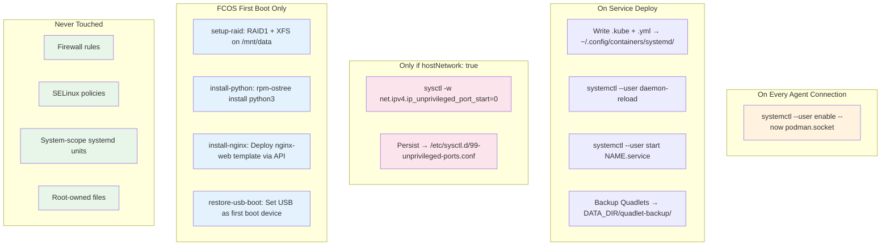
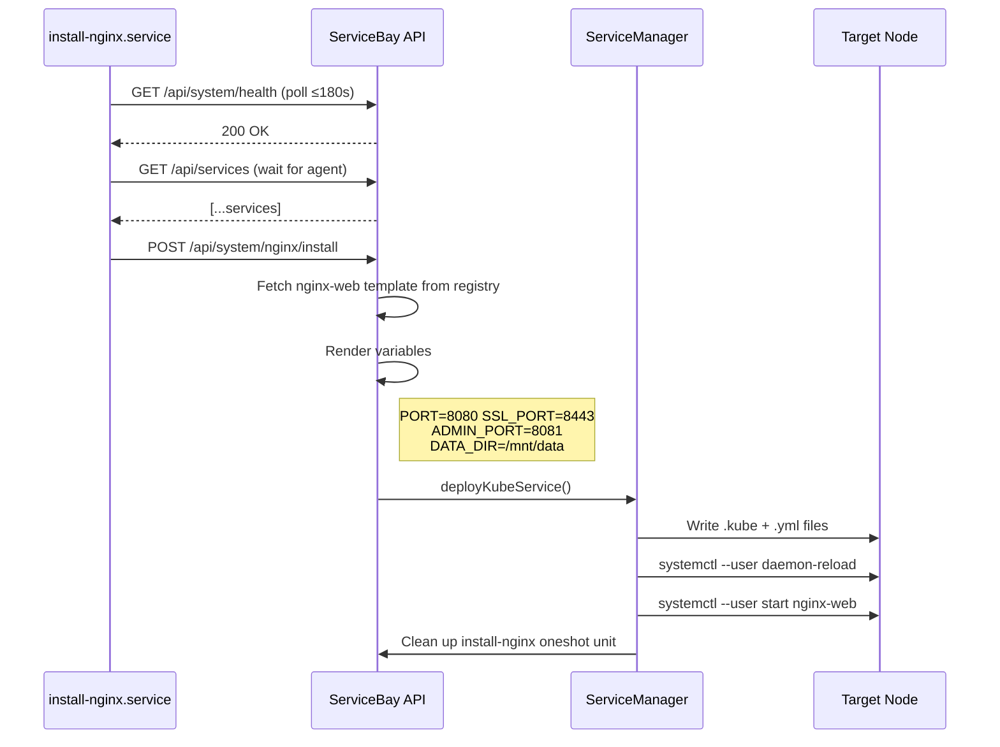

# Installation & Startup Documentation

## 1. FCOS Installation: Build Pipeline



## 2. FCOS Installer Prompts

```
┌─────────────┬──────────────────────────────┬────────────┬────────────┐
│ Section     │ Prompt                       │ Default    │ Persisted? │
├─────────────┼──────────────────────────────┼────────────┼────────────┤
│ User        │ Host username                │ core       │ ✓          │
│             │ SSH public key               │ —          │ ✓          │
│             │ Console password             │ —          │ ✗ secret   │
├─────────────┼──────────────────────────────┼────────────┼────────────┤
│ Network     │ Interface name               │ enp1s0     │ ✓          │
│             │ Static IP                    │ —          │ ✓          │
│             │ Prefix length                │ 24         │ ✓          │
│             │ Gateway IP                   │ —          │ ✓          │
│             │ DNS servers (;-separated)    │ gateway IP │ ✓          │
├─────────────┼──────────────────────────────┼────────────┼────────────┤
│ ServiceBay  │ Port                         │ 3000       │ ✓          │
│             │ Update channel               │ stable     │ ✓          │
│             │ Admin username               │ admin      │ ✓          │
│             │ Admin password               │ —          │ ✗ secret   │
├─────────────┼──────────────────────────────┼────────────┼────────────┤
│ Gateway     │ FritzBox host (optional)     │ —          │ ✓          │
│             │ FritzBox username            │ —          │ ✓          │
│             │ FritzBox password            │ —          │ ✗ secret   │
├─────────────┼──────────────────────────────┼────────────┼────────────┤
│ Registries  │ Enable servicebay-templates  │ y          │ ✓          │
│ Email       │ SMTP host/port/user/pass/TLS │ —          │ partial    │
│ Backup      │ Restore .tar.gz path         │ —          │ ✗          │
└─────────────┴──────────────────────────────┴────────────┴────────────┘
```

Non-secret values saved to `build/fcos/install-settings.env` — reused on next run.

## 3. What the Butane Template Provisions



## 4. FCOS First Boot Sequence



## 5. Docker Image Build



**Environment baked into image:**

```
NODE_ENV=production    PORT=3000    HOSTNAME=0.0.0.0
HOST_SSH=host.containers.internal   SSH_KEY_PATH=/root/.ssh/id_rsa
```

Container runs as root internally — `UserNS=keep-id` maps to host's rootless user.

## 6. Startup Procedure

```mermaid
flowchart TD
    subgraph "Phase 1 — Config"
        A1[Load .env files] --> A2[Generate session ID<br/>servicebay-DATE-HEX]
        A2 --> A3[migrateConfig<br/>encrypt sensitive fields]
        A3 --> A4[Read + decrypt config.json]
        A4 --> A5[Set log level]
    end

    subgraph "Phase 2 — Server"
        B1[Init Next.js handler]
        B2[Create Socket.IO server<br/>twin:state · node:status<br/>log:entry · term I/O]
    end

    subgraph "Phase 3 — Agents"
        C1[Read nodes.json] --> C2{For each node}
        C2 --> C3[SSH connect<br/>15s timeout · 10s keepalive]
        C3 --> C4["Deploy agent.py via SSH<br/>base64-encoded Python script"]
        C4 --> C5["systemctl --user enable --now podman.socket"]
        C5 --> C6[Agent pushes state<br/>containers · services · files · resources]
    end

    subgraph "Phase 4 — Background"
        D1[Init PTY sessions]
        D2[Start MonitoringService<br/>gateway · podman.socket · services · agents]
        D3[Start GatewayPoller<br/>every 60s]
        D4[Agent health sync<br/>every 30s]
        D5[Registry sync]
        D6[Schedule agent restart<br/>if configured]
    end

    subgraph "Phase 5"
        E1[Listen on :3000]
    end

    A5 --> B1
    B1 --> B2
    B2 --> C1
    C6 --> D1
    D1 --> D2 --> D3 --> D4 --> D5 --> D6
    D6 --> E1

    style E1 fill:#c8e6c9
    style C4 fill:#fff3e0
    style C5 fill:#fce4ec
```



## 7. Agent Connection Detail



## 8. System Modifications



## 9. Nginx Install Detail (FCOS)



## 10. Directory Layout

```
Host filesystem (after FCOS install)
├── /mnt/data/                        ← Persistent storage (RAID)
│   └── servicebay/                   ← DATA_DIR
│       ├── config.json               ← Encrypted app config
│       ├── nodes.json                ← SSH node definitions
│       ├── ssh/
│       │   ├── id_rsa                ← Container→Host SSH key
│       │   └── id_rsa.pub
│       ├── backups/                  ← System backup archives
│       └── quadlet-backup/           ← Quadlet file backup (survives reinstall)
│
└── ~/.config/containers/systemd/     ← Quadlet directory
    ├── servicebay.container          ← ServiceBay itself
    ├── nginx-web.kube                ← Nginx Quadlet
    ├── nginx-web.yml                 ← Nginx Pod YAML
    └── ...                           ← Other deployed services
```

## 11. Container Volumes

```
┌─────────────────────────────────────────────────────────────────┐
│ ServiceBay Container                                            │
│                                                                 │
│  /app/data  ←──────── /mnt/data/servicebay                     │
│                                                                 │
│  /run/user/1000/podman/podman.sock  ←── Host Podman API socket │
│                                                                 │
│  Network: host  (shares host network stack)                     │
│  UserNS: keep-id  (root in container = user on host)           │
└─────────────────────────────────────────────────────────────────┘
```
