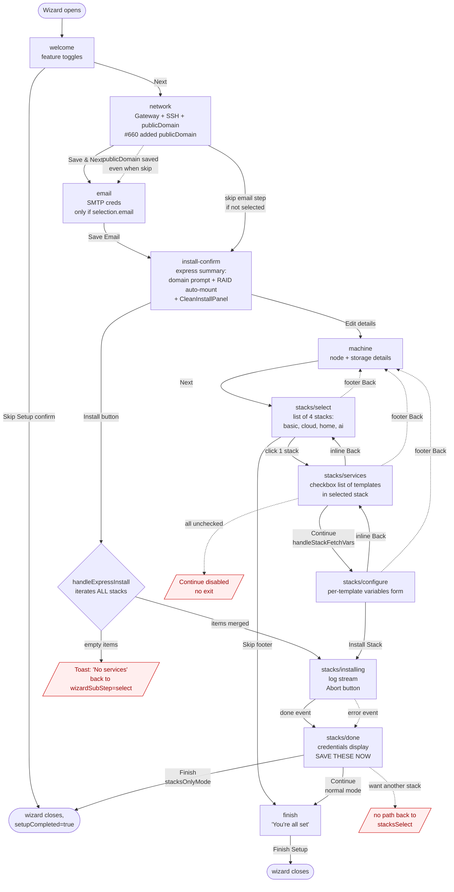
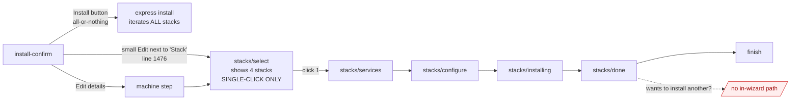
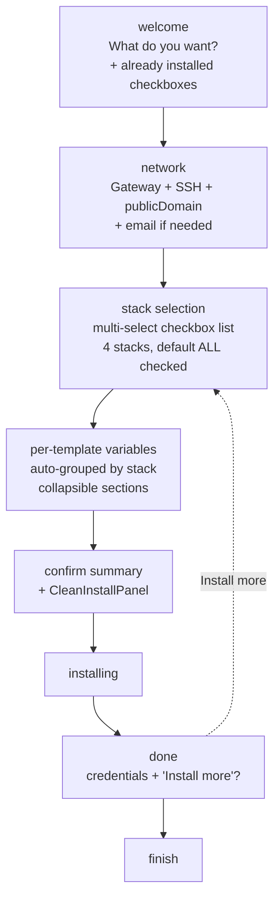

# OnboardingWizard — UX flow audit (2026-05-19)

State machine reconstructed from `src/components/OnboardingWizard.tsx`.
Two state axes: `currentStep` (top-level wizard step) and
`stackInstallStep` (sub-state within `stacks`).

## Flow diagram

## The picker is the trap

The `install-confirm` step has **three escape hatches**, and all
three funnel into the same dead end:

Three buttons, three names — but two routes ("Edit details" and the
small "Edit" next to Stack) lead to the same single-pick stacks
screen. The third (the Install button) skips the picker entirely
and installs *everything*. There is no path that lets the operator
say "install basic + cloud, not the others." The only way to
achieve that today is:

- Install nothing via the wizard
- Close wizard
- Go to /services → Registry
- Install each template manually, one at a time

…which defeats the wizard.

**Runtime is fine with multi-stack.** `handleStackInstall` (line 957)
calls `installFlow.runInstall({ items })` — it takes an arbitrary
items array, doesn't care how many stacks contributed. The "single
stack" constraint is **purely UX** in `stacks/select`. A multi-
select picker is a one-component change in this file with zero
backend impact.

## Identified problems

### 🔴 Dead ends

1. **No way to install multiple stacks via the picker.** After
   `stacks/done`, the only path is `finish` (or close in
   stacksOnlyMode). If the operator picked `cloud` and now wants
   `home`, they have to close the wizard, re-open it, re-navigate
   to stacks. Express install side-steps this by iterating ALL
   stacks, but the explicit picker is single-shot.

2. **Empty README parse strands the user.** If a stack's README
   doesn't match the `- [x] name — desc` regex (downstream registry,
   custom stack), `handleSelectStack` returns `[]` but still
   advances to `stacks/services` with an empty checkbox list. The
   `Continue` button is disabled (zero checked items), the inline
   `Back` goes to `select` — operator can pick again but has no
   feedback about why their first pick was empty.

3. **install-confirm's two "Edit" buttons lead to the same dead
   end with different latencies.** The big "Edit details" button
   routes through `machine` (one redundant step) → `stacks/select`.
   The small inline "Edit" next to Stack jumps directly to
   `stacks/select`. Both screens force single-pick. Operator picks
   either button thinking they're getting flexibility; they aren't.

4. **Stale stack picker after express install completes.** Express
   install sets `selectedStack` to the LAST stack iterated. After
   `done`, if the user backs up (footer Back) they land in the
   stacks step with that stack still selected — confusing because
   they never explicitly picked it.

### 🟡 Confusing navigation

4. **Two `Back` buttons on every stacks/* sub-step.** Footer Back
   uses `handleBack` (pops `stepHistory` → goes to `machine`).
   Inline Back goes one sub-step (`configure` → `services` →
   `select`). They mean different things, are visually adjacent,
   and aren't labelled. Operator picks one randomly and is surprised.

5. **install-confirm collects publicDomain AND network step
   collects publicDomain** (after #662). Two-prompt for the same
   field if the operator backs up — they see their value either
   pre-filled or empty depending on which path they took.

6. **install-confirm's Install button has 3 enabling conditions**
   (`publicDomain || stackNoDomain`, valid email, RESET-confirm).
   When disabled, no copy explains why. Operator stares at greyed-
   out button.

7. **`Skip` button on `stacks/select` looks like "skip this stack"
   but it's "skip stack installation entirely"** — and in non-
   stacksOnlyMode it advances to `finish`, not back to wizard.
   Mislabeled.

### 🟠 State leakage

8. **`stacksOnlyMode`** changes button labels and exit behavior
   subtly across multiple steps. Not always obvious from inside
   the wizard which mode you're in — when invoked via "Install
   another stack" from the sidebar vs. fresh setup, the
   `Finish`/`Continue` distinction matters but isn't surfaced.

9. **`stackInstallStep` lives outside `currentStep`.** Footer
   Back's `handleBack` (which pops `stepHistory`) ignores
   `stackInstallStep`. So at `stacks/configure`, footer Back jumps
   to `machine` (correct from `stepHistory` POV) but the operator
   expected to step back one sub-state.

### 🔵 Express install gotchas (post #660 refactor)

10. **Express install bypasses the per-stack confirmation.**
    Iterates all 4 stacks, deduplicates templates, installs
    everything. Operator doesn't see "you're about to install
    cloud + home + ai + basic" — just an aggregate summary on
    install-confirm. Surprise blast radius.

11. **No granularity in express install.** All-or-nothing. The
    "Edit details" path that should offer fine control instead
    funnels into single-pick (problem #1, #3). The wizard literally
    has no UI for "install 2 stacks but not the others."

12. **The wizard's "expert" path (Edit details → machine → stacks)
    is strictly *less capable* than the "express" path.** Express
    installs all 4 stacks; expert installs 1. That's an inverted
    capability gradient — the more clicks you do, the less power
    you have. Every other wizard in the world works the opposite
    way.

## Recommended UX

Key changes:
- Collapse `welcome → network → email → install-confirm → machine`
  into 2 steps: `welcome` (intent) + `network` (everything network-
  related, including publicDomain).
- Replace `stacks/select` (single-pick) with multi-select default-
  all-checked.
- Drop the express-vs-edit split. Both paths converge.
- `done` step offers "Install more" loop back so multi-stack
  workflows don't require closing the wizard.
- Single Back button everywhere — the footer one, walks history.

## Target state — minimum viable fix (this PR scope)

Full rework is multi-PR. The MVP that unblocks the operator's
"basic + cloud only" use case is narrower: turn the single-pick
picker into a multi-select picker, route both "Edit" buttons to
the same place, and add a "Install more" loop on `done`.

### What changes

1. **`stacks/select` becomes multi-select.** Tiles → checkbox rows.
   Each row shows: stack name, label, template count, brief
   description. Default-all-checked for first-run; default-none
   for "Install another" re-entries.

2. **State shape:** `selectedStack: Template | null` → `selectedStacks: Template[]`.
   Update `handleSelectStack` to take an array, accumulate
   templates across all selected stacks (deduped by name).

3. **Two install-confirm "Edit" buttons → one.** The big "Edit
   details" stays. The small inline "Edit" next to Stack goes
   away (it was a confusing shortcut to the same destination as
   the bigger button).

4. **`stacks/done` adds "Install another" button.** Resets sub-
   step to `select`, clears `selectedStacks`, returns the
   operator to the picker with no stacks pre-checked. Existing
   "Continue" / "Finish" semantics preserved.

5. **No machine-step changes.** Existing flow stays.

6. **No flow-step consolidation.** That's a follow-up. This PR
   just unblocks granular selection within the existing flow.

### What gets cleaned up

- `selectedStack` single-value state — removed.
- The unused `setSelectedStack(null)` reset in the inline Back
  handler — adjusted to clear the array.
- `stacks/select`'s "Pick a curated set of services" copy —
  rewritten for multi-select.
- The "Edit" button on the install-confirm Stack summary line.

### What stays

- Express install (the Install button on install-confirm). It
  still iterates `availableStacks`. Operators who want
  everything click the big button on install-confirm. Operators
  who want subset use the now-multi-select picker.
- All wizard sub-step logic (`select → services → configure →
  installing → done`).
- The two-back-button issue (footer + inline). That's a follow-
  up — needs a separate decision on which to keep.

### Migration

The hook `useStackInstall` and the install runner don't change.
`handleStackInstall` already accepts `itemsOverride: StackItem[]`
which works regardless of how items were aggregated. The picker
now feeds a merged array; the rest of the pipeline doesn't
notice.
