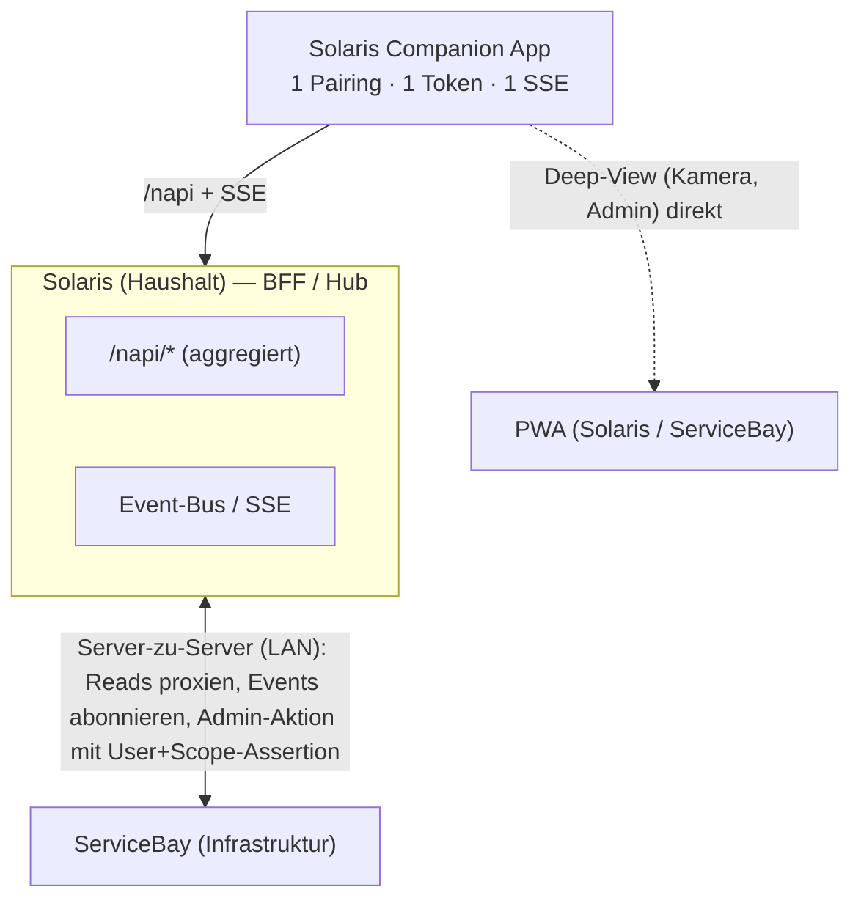

# ADR 0011 — App-Integrationen server-seitig aggregieren (Solaris als BFF/Hub)

- **Status:** Accepted (2026-07-13)
- **Date:** 2026-07-13
- **Deciders:** @mdopp
- **Related ADRs:** [0009](0009-service-tokens-and-trust.md) (service tokens & trust — the Auth-Delegation foundation this ADR builds on)

## Context

Die Solaris-Companion-Android-App ist bewusst eine **dünne, stabile Hülle** (Widgets + Onboarding); die sich ändernde Logik lebt server-seitig. App-Updates sind teuer (Sideload, versionCode). Mit wachsender ServiceBay-Integration (Approvals, Dienste-Status, Updates, Zugangs-Anfragen) wäre der naive Weg eine **Multi-Server-App**: koppelt an Solaris *und* ServiceBay, zwei Tokens, zwei `/napi`-Flächen, zwei Realtime-Verbindungen. Das treibt App-Komplexität, Auth-Fläche, Akku (mehrere Foreground-SSE) und erzwingt pro Integration ein App-Release. ServiceBay hat bereits ein Companion-`/napi` (#2252: `/napi/approvals`, `/napi/home`) — Frage: konsumiert das Handy es direkt, oder aggregiert Solaris?

## Decision

- Die App spricht mit **genau einem Backend: dem Solaris des Haushalts** — ein Pairing, ein Device-Token, ein `/napi`, eine Realtime-SSE.
- **Solaris ist das Backend-for-Frontend / der Hub**: es integriert ServiceBay **server-zu-server** über das vertraute LAN — proxied/aggregiert ServiceBay-Reads unter seinem eigenen `/napi/…` und **republiziert ServiceBay-Events auf seinem Event-Bus**, sodass die App alles über ihre *eine* SSE-Verbindung bekommt.
- **Deep-/Live-Views** (Kamera-Stream, volle Admin-Screens) werden **nicht** geproxied — Widget/App verlinken per Deep-Link direkt in die jeweilige **PWA** (Solaris oder ServiceBay).
- ServiceBays Companion-`/napi` (#2252) wird von **Solaris** (server-server) konsumiert, nicht vom Handy.
- **Mutierende Admin-Aktionen** (Approve/Reject, Dienst-Operate) erfordern, dass Solaris gegenüber ServiceBay **als der authentifizierte Admin-User** handelt: eine **signierte User+Scope-Assertion** über einen mutual-auth Server-Server-Kanal, von ServiceBay geprüft — baut auf **[ADR 0009](0009-service-tokens-and-trust.md) (service tokens & trust)** auf. Das ist der eine harte Teil und bekommt eine eigene Spezifikation.

## Consequences

- **App bleibt dünn:** neue Integration = Server-Arbeit + evtl. ein Widget; kein neues Pairing/Auth/Multi-Server-Code; weniger erzwungene App-Updates.
- **Ein** Auth-Modell, **ein** Onboarding, **eine** Realtime-Verbindung (akkuschonend).
- Solaris übernimmt eine Aggregations-Verantwortung (etwas Domänen-Kopplung an ServiceBays API) — akzeptabel: gleicher Owner, beide auto-loop, Vertrag ist server-server im LAN.
- Auth-Delegation muss sauber designt werden (confused-deputy vermeiden, ADR 0009). Read-Aggregation ist trivial; Mutationen brauchen die Assertion.
- **Ticket-Auswirkung:** solaris-android #41 (Multi-Server-Pairing) entfällt; #40–#45, #43, #50 laufen über Solaris.

## Related

ADR 0009 ([0009-service-tokens-and-trust.md](0009-service-tokens-and-trust.md) — service tokens & trust), `docs/COMPANION_APP.md`; solarisbay #757 (/napi), #2252 (Companion-/napi); solaris-android #40 (ServiceBay-Epic), #47 (Realtime).

> Note: ADR 0009 is currently assigned to two files (`0009-repair-is-reconciliation-not-reinstallation.md` and `0009-service-tokens-and-trust.md`). The "service tokens & trust" ADR referenced above and in the Decision section is `0009-service-tokens-and-trust.md` specifically.
